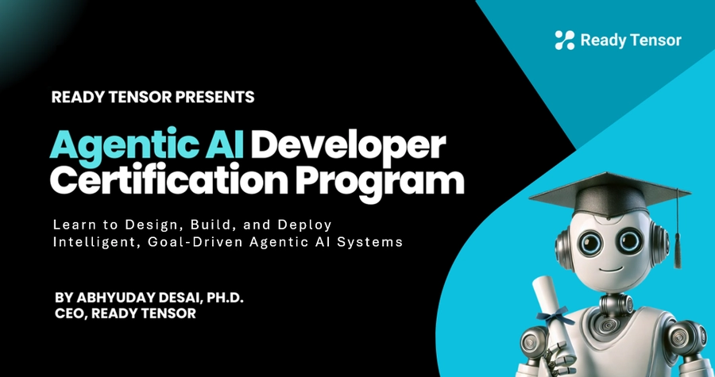

# Agentic AI Developer Certification Program

_A 12-week applied learning experience by Ready Tensor_

> 🧭 This repository is your main hub for the certification program.  
> It contains orientation materials, project submission guidelines, and links to all weekly lesson repositories with code and exercises.

---

## Program Overview

The Agentic AI Developer Certification Program is a hands-on, 12-week journey into building intelligent, autonomous, and collaborative AI systems. Designed by Ready Tensor, the program blends practical instruction with real-world project work to help you master the tools, techniques, and thinking needed to build agentic systems that reason, plan, and take action.

You’ll move beyond basic prompt engineering and chatbot interfaces to design goal-driven agents using frameworks like LangChain and LangGraph, work with vector databases and RAG pipelines, and build systems that are production-grade and portfolio-ready.

---

## Program Structure: Modules & Weekly Flow

This program is structured into **three comprehensive modules**, each culminating in a practical, portfolio-worthy project:

- **Module 1 (Weeks 1–4): Foundations of Agentic AI**  
  Explore core concepts including agent architectures, retrieval-augmented generation (RAG), and tool use. You'll build your first project — a question-answering assistant powered by RAG.

- **Module 2 (Weeks 5–8): Architecting Multi-Agent Workflows**  
  Build collaborative, tool-using agentic AI systems. In this module, you’ll design dynamic agents, implement multi-agent workflows, and integrate external tools using protocols like MCP. Your project will showcase a working multi-agent system that solves a real problem through coordination and orchestration.

- **Module 3 (Weeks 9–12): Real-World Readiness**  
  Learn to test, secure, deploy, and monitor your agentic systems using guardrails, observability, and lightweight hosting. You’ll wrap up the program with a production-aware, portfolio-ready capstone project.

---

## Project-Based Certification

Each module ends with a hands-on project that demonstrates your understanding of key concepts — from building RAG assistants to multi-agent systems to production-ready applications.

To earn certification, participants must complete and submit all three projects on the Ready Tensor platform. Each project is evaluated independently, and submissions must meet the scoring threshold to qualify for certification.

Successful participants will receive:

- A **certificate** for each module and a final **Agentic AI Developer Certificate**
- **Digital badges** to showcase on LinkedIn and your Ready Tensor profile

Projects are designed to be portfolio-worthy and reflect real-world skills.

---

## How to Use This Repository

This is the **main repository** for the Agentic AI Developer Certification Program. It serves as your central hub for:

- Accessing key lessons that are **not tied to any specific week**, such as:

  - **Program Overview**
  - **Welcome & Orientation**
  - **Project Requirements and Submission Guidelines** for Weeks 4, 8, and 12

- Finding direct links to each week's **lesson repositories**, which include:
  - Written lesson content
  - Code examples
  - Exercises and walkthroughs

Each week’s materials are maintained in a separate repo to keep things organized and modular.

Use this repository to:

- Understand the structure and expectations of the program
- Review program-wide instructions and submission processes
- Navigate quickly to weekly lessons and project guidelines

---

## Program Resources and Instructions

This repository includes important materials that support the entire certification journey. These documents are not tied to any specific weekly lesson repo — they apply across modules and help you get oriented and stay on track with project submissions.

- [📘 Program Overview](./program_docs/program-overview/program-overview.md)
- [🎥 Welcome & Orientation](./program_docs/program-welcome-and-orientation/program-welcome-and-orientation.md)

- **🛠 Project Requirements and Submission Guidelines**
  - [Project 1 Requirements](./program_docs/project1/project1-requirements.md)
  - [Project 1 Submission Guidelines](./program_docs/project1/project1-submission-guidelines.md)
  - [Project 2 Requirements](./program_docs/project2/project2-requirements.md)
  - [Project 2 Submission Guidelines](./program_docs/project2/project2-submission-guidelines.md)
  - [Project 3 Requirements](./program_docs/project3/project3-requirements.md)
  - [Project 3 Submission Guidelines](./program_docs/project3/project3-submission-guidelines.md)

---

## Lesson Index on Ready Tensor

You can view all lesson publications from this certification program on the Ready Tensor platform. Each lesson includes the full write-up, videos, and any embedded resources.

📚 Browse the full list below:

| week |                                          publication_title                                           |                         url                          |
| ---- | :--------------------------------------------------------------------------------------------------: | :--------------------------------------------------: |
| 0    |                  Program Guide: Agentic AI Developer Certification by Ready Tensor                   | https://app.readytensor.ai/publications/HrJ0xWtLzLNt |
| 0    |                  Agentic AI Developer Certification Program: Welcome & Orientation                   | https://app.readytensor.ai/publications/kwFKTldV27nA |
| 1    |                              What is Agentic AI (AAIDC-Week1-Lesson-1)                               | https://app.readytensor.ai/publications/g8QivAEShqgw |
| 1    |                       The Core Components of AI Agents (AAIDC-Week1-Lesson-2)                        | https://app.readytensor.ai/publications/O8OHY0ehCvdr |
| 1    |                     Real-World Applications of Agentic AI (AAIDC-Week1-Lesson-3)                     | https://app.readytensor.ai/publications/EbfPXrWQMeCh |
| 1    |                        Agentic AI: Tools of the Trade (AAIDC-Week1-Lesson-4)                         | https://app.readytensor.ai/publications/hjbeURATH5ul |
| 1    |                       Agentic AI: Agents vs. Workflows (AAIDC-Week1-Lesson-5)                        | https://app.readytensor.ai/publications/Xq3L2HSWLPou |
| 2    |         Getting Started with Agentic AI: Free APIs and Local LLM Options (AAIDC-Week2-Setup)         | https://app.readytensor.ai/publications/HMONylFlvgvC |
| 2    |                   Building Prompts for Agentic AI Systems (AAIDC-Week2-Lesson-1a)                    | https://app.readytensor.ai/publications/36Hu3DC3TLdu |
| 2    |             Prompt Engineering: Advanced "Reasoning" Techniques (AAIDC-Week2-Lesson-1b)              | https://app.readytensor.ai/publications/3jI5t1hwF8wM |
| 2    |                From Text to Data: Hands-On LLM Output Parsing (AAIDC-Week2-Lesson-2)                 | https://app.readytensor.ai/publications/LHMxs5Dtsv26 |
| 2    |       Building Intelligent Pipelines: A Guide to LLM Function Chaining (AAIDC-Week2-Lesson-3)        | https://app.readytensor.ai/publications/X51gr9ZwohcW |
| 2    |          Vector Databases: How AI Finds Meaning, Not Just Keywords (AAIDC-Week2-Lesson-4a)           | https://app.readytensor.ai/publications/Zdrul0fG17Mg |
| 2    |            Vector Databases: Building a Semantic Retrieval System (AAIDC-Week2-Lesson-4b)            | https://app.readytensor.ai/publications/hwjIdxHZGASQ |
| 2    |         Introduction to RAG (Retrieval Augmented Generation) Systems (AAIDC-Week2-Lesson-5)          | https://app.readytensor.ai/publications/3Ht58iNXuvS7 |
| 3    |                   Week 3 Preview: Your RAG Assistant Toolkit (AAIDC-Week3-Preview)                   | https://app.readytensor.ai/publications/gleIJzLtXA3m |
| 3    |          Your First LLM Calls: Getting Started with Groq & LangChain (AAIDC-Week3-Lesson-1)          | https://app.readytensor.ai/publications/BJbtjKH15JHb |
| 3    |                  System Prompts: Your AI's Operating Manual (AAIDC-Week3-Lesson-2)                   | https://app.readytensor.ai/publications/t79Iyg4lva2t |
| 3    |        Memory Management Strategies: When Conversations Get Too Long (AAIDC-Week3-Lesson-3a)         | https://app.readytensor.ai/publications/WCVvtUtH3N1o |
| 3    |           Memory Persistence: Saving Conversations Across Sessions (AAIDC-Week3-Lesson-3b)           | https://app.readytensor.ai/publications/Ax1KnCSIt9QI |
| 3    |      Building Your Research Assistant: A Step-by-Step RAG Implementation (AAIDC-Week3-Lesson-4)      | https://app.readytensor.ai/publications/IBOMURRgN8Dn |
| 4    |             AAIDC Module 1 Project: Foundations of Agentic AI – Your First RAG Assistant             | https://app.readytensor.ai/publications/4n07ViGCey0l |
| 4    |                 Project 1 Submission Guidelines - Agentic AI Developer Certification                 | https://app.readytensor.ai/publications/BblNcQTBi5Os |
| 5    |               Week 5 Preview: From Workflows to Agentic Systems (AAIDC-Week5-Preview)                | https://app.readytensor.ai/publications/jcd9IGoIp9sl |
| 5    |        From Workflows to Agents: When Predictable Paths Aren't Enough (AAIDC-Week5-Lesson-1)         | https://app.readytensor.ai/publications/Nu7EEaBmrP5C |
| 5    |       Building Agentic Systems at Scale: An Introduction to LangGraph (AAIDC-Week5-Lesson-2a)        | https://app.readytensor.ai/publications/J98Nkhh5Z8CW |
| 5    |              Your First LangGraph Project: Building a Joke Bot (AAIDC-Week5-Lesson-2b)               | https://app.readytensor.ai/publications/T8WbWCjwJ4Mm |
| 5    |           Agentic AI With LangGraph: Building a Writer–Critic Loop (AAIDC-Week5-Lesson-2c)           | https://app.readytensor.ai/publications/zvrcImvr8AF4 |
| 5    |           Inside the Mind of an Agent: Observability with LangSmith (AAIDC-Week5-Lesson-3)           | https://app.readytensor.ai/publications/XOuxwqlmJmMG |
| 5    |         Beyond Conversation: Giving Your AI Agent the Power of Tools (AAIDC-Week5-Lesson-4a)         | https://app.readytensor.ai/publications/hHwXrjkLnNaD |
| 5    |       Custom Tools, Custom Powers: Extending Your Agent’s Capabilities (AAIDC-Week5-Lesson-4b)       | https://app.readytensor.ai/publications/pcFgUEFJjkzC |
| 6    |                Week 6 Preview: Architecting Multi-Agent Systems (AAIDC-Week6-Preview)                | https://app.readytensor.ai/publications/gleIJzLtXA3m |
| 6    |     Architecting Intelligence: Design Patterns for Multi-Agent AI Systems (AAIDC-Week6-Lesson-1)     | https://app.readytensor.ai/publications/Sp2HOfRpH4Fl |
| 6    |     From Idea to Architecture: Defining Our Agentic Authoring Assistant (AAIDC-Week6-Lesson-2a)      | https://app.readytensor.ai/publications/Gq1xQ27DmJ56 |
| 6    |   From Architecture to Implementation: Building the Tag Extraction System (AAIDC-Week6-Lesson-2b)    | https://app.readytensor.ai/publications/D3vJsJh1500g |
| 6    |       Building the Dream Team: Designing the Right Agents for the Job (AAIDC-Week6-Lesson-3a)        | https://app.readytensor.ai/publications/qtRz3uuXGx5Y |
| 6    |   Orchestrating Intelligence: Designing Agentic Systems That Actually Work (AAIDC-Week6-Lesson-3b)   | https://app.readytensor.ai/publications/redklSjefHNo |
| 6    |              MCP: A Standard Way for AI to Use External Tools (AAIDC-Week6-Lecture-4a)               | https://app.readytensor.ai/publications/LAeGUSWv4dKb |
| 6    |         MCP in Action: Connecting and Creating Real AI Integrations (AAIDC-Week6-Lesson-4b)          | https://app.readytensor.ai/publications/35v0wzEbKZBo |
| 7    |                   Week 7 Preview: Evaluating Agentic Systems (AAIDC-Week7-Preview)                   | https://app.readytensor.ai/publications/LZYqZkLL09bo |
| 7    |               Evaluating Agentic AI: Beyond Traditional Testing (AAIDC-Week7-Lesson1)                | https://app.readytensor.ai/publications/FO7hdfmkhl42 |
| 7    |             The Evaluation Toolkit: Methods for Testing Agentic AI (AAIDC-Week7-Lesson2)             | https://app.readytensor.ai/publications/ljPGqR17HJmj |
| 7    |       Your System, Your Metrics: A Practical Guide to Agentic Evaluation (AAIDC-Week7-Lesson3)       | https://app.readytensor.ai/publications/68dY0FXJ1gI1 |
| 7    |          How to Evaluate LLM Applications: A Complete RAGAS Tutorial (AAIDC-Week7-Lesson4)           | https://app.readytensor.ai/publications/Frw6T1fBzVTF |
| 7    |         How to Evaluate LLM Applications: A Complete DeepEval Tutorial (AAIDC-Week7-Lesson5)         | https://app.readytensor.ai/publications/6QRSBm5gdx2J |
| 7    |         Evaluating Multi-Agent AI Systems: A Comprehensive Case Study (AAIDC-Week7-Lesson6)          | https://app.readytensor.ai/publications/t6q6c0SSuM0W |
| 8    |                        AAIDC Module 2 Project: Build Your Multi-Agent System                         | https://app.readytensor.ai/publications/gUPu2RlgjzNy |
| 8    |   AAIDC Module 2 Project Submission Guidelines - Agentic AI Developer Certification (AAIDC-Week8)    | https://app.readytensor.ai/publications/Vyezy1rDg6K3 |
| 9    |      Week 9 Preview: Testing Agentic AI Systems for Real-World Readiness (AAIDC-Week9-Preview)       | https://app.readytensor.ai/publications/h4GLp8hyNZDt |
| 9    |    Production Testing for Agentic AI Systems: What Developers Need to Know (AAIDC-Week9-Lesson1)     | https://app.readytensor.ai/publications/Os3lVD6k6e3R |
| 9    |          Getting Started with pytest: Your Agentic Testing Toolkit (AAIDC-Week9-Lesson-2a)           | https://app.readytensor.ai/publications/cpoAQfEZCcmi |
| 9    |  Testing Agentic AI Applications: How to Use Pytest for LLM-Based Workflows (AAIDC-Week9-Lesson-2b)  | https://app.readytensor.ai/publications/GRFinafIgmcv |
| 9    |      Autonomy Meets Attack: Securing Agentic AI from Real-World Exploits (AAIDC-Week9-Lesson3)       | https://app.readytensor.ai/publications/iEJ8OiUoSXRY |
| 9    |            AI That Doesn’t Harm: Principles of Safety and Alignment (AAIDC-Week9-Lesson4)            | https://app.readytensor.ai/publications/2I2CRYlJrUZJ |
| 9    |   Guardrails in Action: Runtime Safety and Output Validation for Agentic AI (AAIDC-Week9-Lesson5)    | https://app.readytensor.ai/publications/tiBt9Nevyqrw |
| 9    |      Giskard in Action: Scanning Agentic AI for Bias and Vulnerabilities (AAIDC-Week9-Lesson6)       | https://app.readytensor.ai/publications/4PVxbVYFrLVO |
| 9    |          Testing Agentic AI: A Case Study on Multi-Agent LLM Systems (AAIDC-Week9-Lesson7)           | https://app.readytensor.ai/publications/uDLdzgPAQ5BZ |
| 10   |          Packaging Your Agentic AI: From Demo to Production Handoff (AAIDC-Week10-Preview)           | https://app.readytensor.ai/publications/cPsF3K8r69bd |
| 10   |          FastAPI Fundamentals: Building Web APIs for Your AI Agents(AAIDC-Week10-Lesson1a)           | https://app.readytensor.ai/publications/3FLDYUhZnlTu |
| 10   |                   Hosting FastAPI AI application on Render (AAIDC-Week10-Lesson1b)                   | https://app.readytensor.ai/publications/i3gMkNkTokWR |
| 10   |           Gradio for Developers: Build and Share AI Demos Instantly (AAIDC-Week10-Lesson2)           | https://app.readytensor.ai/publications/pZxv9sd7Bk75 |
| 10   |       Build and Deploy AI Chatbots with Streamlit: A Step-by-Step Guide (AAIDC-Week10-Lesson3)       | https://app.readytensor.ai/publications/KNnkpIlfXLoP |
| 10   |    Resilience in Agentic AI: How to Handle Failures and Recover Gracefully (AAIDC-Week10-Lesson4)    | https://app.readytensor.ai/publications/S1AMb9G3IMqX |
| 10   |  Deploying Agentic AI: Documentation and Handoff Guide for LLM-Based Systems (AAIDC-Week10-Lesson5)  | https://app.readytensor.ai/publications/Al9E4GsrKoKC |
| 11   |      Week 11 Preview: Monitoring, Observability & Real-World Agentic AI (AAIDC-Week11-Preview)       | https://app.readytensor.ai/publications/dkWUcl9DJl6b |
| 11   |  Monitoring and Observability 101: Understanding Metrics, Logs, and Traces (AAIDC-Week11-Lesson1a)   | https://app.readytensor.ai/publications/3p414r28A7UU |
| 11   |      What to Monitor in Agentic AI: Detecting Failures Before Users Do (AAIDC-Week11-Lesson1b)       | https://app.readytensor.ai/publications/McNh5g2RBFKq |
| 11   | Monitoring and Observability Tools: Choosing the Right Stack for LLM Systems (AAIDC-Week11-Lesson1c) | https://app.readytensor.ai/publications/z0GUbKAFMf9l |
| 11   |     Troubleshooting Agentic AI: Debugging Failures in Production Systems (AAIDC-Week11-Lesson1d)     | https://app.readytensor.ai/publications/6qmc6P1CWNGY |
| 11   |     Data Privacy in Agentic AI: GDPR, HIPAA, and Developer Best Practices (AAIDC-Week11-Lesson2)     | https://app.readytensor.ai/publications/hQirE9Zfqpje |
| 11   |    Proprietary vs Open Weight LLMs: How to Choose for Your Agentic System (AAIDC-Week11-Lesson3)     | https://app.readytensor.ai/publications/Kev4TxRgmnUn |
| 11   |   Designing Agentic AI: System Architect's Blueprint for Production Success (AAIDC-Week11-Lesson4)   | https://app.readytensor.ai/publications/DBt437eCRgoK |
| 12   |                      AAIDC Module 3 Project: Productionize Your Agentic System                       | https://app.readytensor.ai/publications/DSYotKAAvcxy |
| 12   |          Agentic AI Developer Certification: Project 3 Submission Guidelines (AAIDC-Week12)          | https://app.readytensor.ai/publications/NFFBd0CLuHqF |

---

## Weekly Lesson Repositories

Each week’s lesson content and code examples are maintained in a dedicated GitHub repository. These repos contain:

- Written lessons and walkthroughs
- Code examples and templates
- Supplementary resources (diagrams, configs, etc.)

You can explore each week’s materials by visiting the corresponding repository below:

| Week | Focus Area                           | Repository Link                                                          |
| ---- | ------------------------------------ | ------------------------------------------------------------------------ |
| 1    | Introduction to Agentic AI           | [Week 1 Repo](https://github.com/readytensor/rt-agentic-ai-cert-week1)   |
| 2    | Prompts, RAG, Embeddings             | [Week 2 Repo](https://github.com/readytensor/rt-agentic-ai-cert-week2)   |
| 3    | LLM Calls, Memory, Full RAG Pipeline | [Week 3 Repo](https://github.com/readytensor/rt-agentic-ai-cert-week3)   |
| 5    | Agent Architectures, LangGraph Intro | [Week 5 Repo](https://github.com/readytensor/rt-agentic-ai-cert-week5)   |
| 6    | Multi-Agent Systems, MCP             | [Week 6 Repo](https://github.com/readytensor/rt-agentic-ai-cert-week6)   |
| 7    | Agent Evaluation Techniques          | [Week 7 Repo](https://github.com/readytensor/rt-agentic-ai-cert-week7)   |
| 9    | Testing, Guardrails, Safety          | [Week 9 Repo](https://github.com/readytensor/rt-agentic-ai-cert-week9)   |
| 10   | Deployment with FastAPI, Streamlit   | [Week 10 Repo](https://github.com/readytensor/rt-agentic-ai-cert-week10) |
| 11   | Monitoring, Debugging, Case Studies  | [Week 11 Repo](https://github.com/readytensor/rt-agentic-ai-cert-week11) |

> 🧱 **Note:** Weeks 4, 8, and 12 are project-focused and do not have dedicated lesson repositories. Instead, you’ll find project requirements and submission instructions under [Program Resources and Instructions](#program-resources-and-instructions) in this README.

---

## Contributing or Getting Help

### 🙋 Need Help?

If you have questions about lessons, projects, or how the program works:

- **Ask in the Community**: Join the discussion on [Ready Tensor’s Discord](https://discord.gg/readytensor) — it's the best place to get help from mentors and peers.
- **Check the Program Overview**: The [Program Overview](./program_docs/program-overview/program-overview.md) includes answers to many common questions about structure, submissions, and certification.

---

### 🤝 Want to Contribute?

We welcome contributions that help improve the program experience!

- Found a bug or typo in the content?
- Want to suggest a fix or improvement to a code example?
- Have a resource or case study to recommend?

Open an issue or submit a pull request to the relevant weekly lesson repository. For general improvements to this main repo, feel free to open a PR here.

All contributions should align with the goal of helping participants learn to build robust, real-world agentic AI systems.

---

## About Ready Tensor

[Ready Tensor](https://readytensor.ai) is a platform for publishing, sharing, and collaborating on AI and data science projects. Our mission is to help developers, researchers, and teams build and showcase real-world AI systems — with transparency, rigor, and practical value.

This certification program is part of our broader effort to empower the next generation of AI engineers through applied, project-based learning in areas like agentic AI, LLM pipelines, and multi-agent systems.

🌐 **Explore our certification programs**: [AI Certifications by Ready Tensor](https://www.readytensor.ai/certifications/)

---

## License

All written materials and instructional content in this repository are licensed under the  
[Creative Commons Attribution-NonCommercial-ShareAlike 4.0 International (CC BY-NC-SA 4.0)](https://creativecommons.org/licenses/by-nc-sa/4.0/) license.

You are free to:

- **Share** — copy and redistribute the material in any medium or format
- **Adapt** — remix, transform, and build upon the material

Under the following terms:

- **Attribution** — You must give appropriate credit and indicate if changes were made.
- **NonCommercial** — You may not use the material for commercial purposes.
- **ShareAlike** — If you remix or build upon the material, you must distribute your contributions under the same license.

See the [LICENSE](./LICENSE) file for full details.
