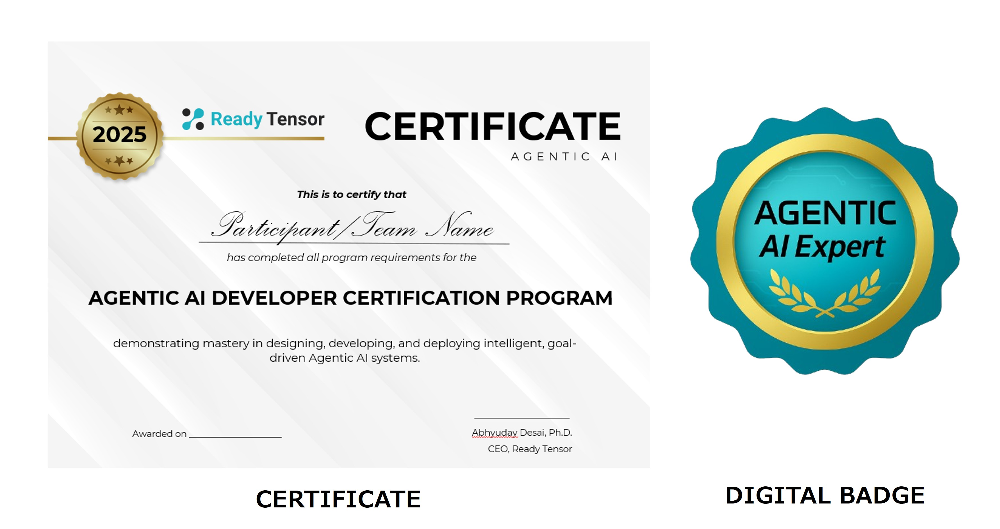

 <!-- RT_DIVIDER -->

Welcome to the **Agentic AI Developer Certification Program** by Ready Tensor! This is a **100% FREE** 12-week, hands-on learning journey where you'll design, build, and deploy intelligent, goal-driven AI systems.

 <!-- RT_DIVIDER -->

# What You'll Learn

This program is structured into three comprehensive modules, each culminating in a practical, portfolio-worthy project:

- **Module 1 (Weeks 1–4): Foundations of Agentic AI**
  Explore core concepts including agent architectures, retrieval-augmented generation (RAG), and tool use. You'll build your first project—a question-answering assistant.

- **Module 2 (Weeks 5–8): Architecting Multi-Agent Systems**
  Build collaborative, tool-using agentic AI systems. In this module, you’ll design dynamic agents, implement multi-agent workflows, and integrate external tools using protocols like MCP. Your project will showcase a working multi-agent system that solves a real problem through coordination and orchestration.

- **Module 3 (Weeks 9–12): Real-World Readiness**
  Learn to test, secure, deploy, and monitor your agentic systems with guardrails, logging, and lightweight hosting. Finish with a production-grade, portfolio-ready final project.

 <!-- RT_DIVIDER -->

# What You’ll Earn

Complete the program and earn credentials that prove your hands-on expertise:

## 🏆 Certificates of Completion

You’ll earn **one certificate for each module** upon completing its associated project. After completing all three modules and meeting the program requirements, you’ll receive a **final certificate** recognizing your full certification as an **Agentic AI Developer**.

## 🎖️ Digital Badges

In addition to certificates, you’ll receive **four digital badges**—one for each module and one for completing the full program. These badges will be displayed on your **Ready Tensor profile page** and can be used to showcase your achievements on LinkedIn or other professional platforms.

> _Badges and certificates signal real-world, project-based competency in agentic AI systems._

 <h2> 👇 Sample Certificate and Badge </h2>
 
 
 
 
 ## 💼 Real-World Portfolio Projects
 
 Every certified project you complete is published on the Ready Tensor platform — with documentation, code links, and a dedicated project page. These are professional-grade deliverables that you can share with employers, collaborators, and the broader AI community.
 
 > Your certification is more than a badge — it’s backed by public proof of work.
 
 ---
 
 <!-- RT_DIVIDER -->
 # How to Enroll
 
 ## If you don’t have a Ready Tensor account yet  
 1. **Register for a free account** on Ready Tensor. [Sign up here](https://app.readytensor.ai/signup).  
 2. After signing up, you’ll go through our quick onboarding process:  
    - Add your name and optional details like location, organization, and short bio.  
    - Select the topics you’re most interested in.  
    - On the “What brings you to Ready Tensor?” page, find the **Join our certification program** section and click **Join the Program** under *Agentic AI Developer Certification Program*.  
 3. You’ll be enrolled immediately and taken to the **Welcome & Orientation** page to get started.  
 
 ## If you already have a Ready Tensor account  
 1. **Log in** to your account.  
 2. Visit the [`Ready Tensor Certifications` hub](https://app.readytensor.ai/hubs/ready_tensor_certifications).  
 3. Click the **Join Hub** button at the top of the page. Once you’re enrolled, the button will disappear — that’s your confirmation you’re in the program. If the button is already missing when you arrive, you’re already enrolled.  
 
 > **IMPORTANT:** Joining the certifications hub is what officially enrolls you in the program. This ensures you receive all program benefits — including updates, reminders, and community announcements — even though you already have access to the lessons.
 
 ---
 
 <!-- RT_DIVIDER -->
 
 # How the Program Works
 
 The **Agentic AI Developer Certification Program** is organized into **three modules**, each designed to take about four weeks.  
 - **Each module ends with a hands-on project** — your primary goal for that module.  
 - Successfully completing a module’s project earns you a **micro-certificate** for that module.  
 - Complete all three modules to earn the **full Agentic AI Developer Certificate**.
 
 ## Flexible Pace to Fit Your Schedule  
 The program is designed for a 12-week pace, but you’re free to move faster. Highly motivated participants — especially those with prior experience — often complete a module in as little as a week. You control your learning speed, and there are no penalties for finishing early or taking longer.
 
 ## Your Focus: Complete the 3 Projects  
 While lessons are valuable learning resources, the main objective is to **successfully deliver the three projects**. These projects demonstrate your ability to design, build, and deploy agentic AI systems — and they’re what you’ll be evaluated on.
 
 ## Learning Materials  
 All lessons, videos, publications, and code templates are provided up front so you can learn at your own pace. Lessons are there to **support your project work** — not as rigid prerequisites — and may include:  
 - Walkthrough videos  
 - Expert commentary  
 - Quizzes for self-check  
 - Reference code repositories
 
 ## Community Engagement  
 Join our [Discord](https://discord.gg/EsVfxNdUTR) for ongoing discussions, Q&A, team formation, and peer support.
 
 ## Project Submissions & Reviews  
 - You’ll submit **three main projects** — one per module — either individually or in a team (up to 5 people).  
 - Projects can be submitted in any order.  
 - Each project is reviewed independently, and your submission will be evaluated in the **next available review cycle** based on its submission date (see **Project Submission & Evaluation Timeline**).  
 
 ## Cost & Certification  
 The program is completely free. You’ll earn:  
 - **One micro-certificate** for each successfully completed module.  
 - The **Agentic AI Developer Certificate** upon successful completion of all three modules.
 
 ---
 <!-- RT_DIVIDER -->
 # Expert Review and Feedback
 
 When you submit your project, it’s not a one-shot pass/fail exam. Each submission is **independently reviewed by an expert**, with detailed feedback on what works, what can be improved, and how to level up your solution.
 
 You’re encouraged to iterate, refine your project, and **resubmit based on feedback** — just like in real-world AI development.
 
 ---
 <!-- RT_DIVIDER -->
 
 :::info{title="Info"}
 If you want to start with the lessons - you can find them here: 
 
 [🏠 All Lessons](https://app.readytensor.ai/hubs/ready_tensor_certifications)  
 
 We recommend that you bookmark the page above. 
 :::
 
 ---
 
 <!-- RT_DIVIDER -->
 
 # Micro-Certifications & Program Flexibility
 
 This program is fully modular — you don’t need to follow the learning modules and lessons in order. If you already have experience with RAG, for example, you can jump straight into Module 2 and complete that project first.
 
 Each module leads to an independent **micro-certificate** and badge:
 
 - 🧠 **Module 1 – RAG Systems Expert**
 - 🤖 **Module 2 – Agentic AI Builder**
 - 🔒 **Module 3 – Agentic AI Engineer**
 
 You'll receive a certificate and digital badge upon completing each module’s project and meeting the requirements.
 
 <h2> 🎓 Earn the Full Certification </h2>
 
 To become a fully certified **Agentic AI Expert**, you must:
 
 - Complete and submit all three module projects
 - Meet the 70% score threshold for each
 - Publish each project on the Ready Tensor platform with code and documentation
 
 This earns you:
 
 - ✅ All three micro-certificates
 - ✅ The official **Agentic AI Developer Certificate**
 - ✅ The “Agentic AI Expert” badge — displayed on your profile and sharable on LinkedIn
 
 ---
 <!-- RT_DIVIDER -->
 
 # Project Submission & Evaluation Timeline
 
 This program is flexible — you can start anytime and move through the modules at your own pace.
 
 To help manage project reviews, we evaluate submissions in **monthly review cycles**.
 
 If you submit a project by one of the deadlines below, it will be reviewed in that month’s cycle. If you miss a deadline, no problem — your project will be evaluated in the next one.
 
 <h2> 📅 Upcoming Evaluation Deadlines  </h2>
 
 | Submission Deadline | Review Period Begins |
 | ------------------- | -------------------- |
 | August 11, 2025      | August 12, 2025       |
 | September 5, 2025   | September 6, 2025    |
 | October 3, 2025     | October 4, 2025      |
 | November 7, 2025    | November 8, 2025     |
 
 > ✅ You can submit **any module’s project** in any order. Submit one, two, or all three — your progress is tracked independently.
 
 <h2>🔍 Example </h2>
 
 If you submit your project on **August 22**, it will be included in the **September 6 review cycle** (based on the September 5 deadline). If you miss that, it rolls forward to the next one.
 
 ---
 
 <!-- RT_DIVIDER -->
 :::info{title="Info"}
 
 <h2>Missed Project Deadline? No Problem</h2>
 
 If you miss one of the listed submission deadlines, don’t worry — your project can still be submitted at any time. It will simply roll forward into the next monthly review cycle.
 
 You won’t lose your work, your progress, or your eligibility. Every project is tracked independently.
 
 :::
 
 ---
 
 <!-- RT_DIVIDER -->
 
 # Free Certification Process
 
 The certification program is completely free. All participants who complete the requirements will receive an official **Agentic AI Developer Certificate**.
 
 To earn your **Agentic AI Developer Certificate**, you must:
 
 - Complete and submit all three hands-on projects: one for each module.
 - Publish each completed project **publicly on the Ready Tensor platform**, including:
 
   - Comprehensive documentation
   - A link to your code repository
 
 - Achieve at least a **70% score per project** based on the evaluation criteria provided in the **AAIDC Project Evaluation Criteria.pdf**.
 
 :::info{title="Project Reviews"}
 Each project is reviewed independently, so you can complete and submit modules at your own pace. Your submission will be evaluated in the next available cohort based on when you submit.
 ::: 
 
 ---
 
 <!-- RT_DIVIDER -->
 # Program Curriculum
 
 <!-- RT_DIVIDER -->
 
 <h2>Module 1: Foundations of Agentic AI (Weeks 1–4)</h2>
 
 Lays the groundwork for understanding and constructing agentic systems.
 
 <h3>Week 1: Introduction to Agentic AI Systems</h3>
 
 - What is Agentic AI? Definitions, terminology, and motivations
 - Core Components of Agentic AI
 - Real-world use cases and emerging trends
 - Tools and Frameworks
 - Differentiation of Agents and Workflows
 
 <h3>Week 2: Prompts, Embeddings and RAG </h3>
 
 - Getting started with free API access and local LLMs
 - Basic prompting
 - Introduction to RAG systems
 - Vector databases and embedding models (FAISS, Chroma, etc.)
 
 <h3>Week 3: Hands-On with LLM calls, workflows and RAG (June 02, 2025)</h3>
 
 - Making your first LLM call
 - Building a Workflow
 - Building a RAG system
 
 <h3>Week 4: Project 1 - Build a RAG-Powered AI App</h3>
 
 - **Project-focused week with no new video lectures or required readings**
 - Participants work on building a question-answering or document-assistant app
 - Chain design: Prompt + Retrieval + Response
 - Integration with a vector store and basic evaluation loop
 - Optional: Add memory, tool usage, or intermediate reasoning
 - Deliverable: A simple RAG-based agent system with working retrieval and output
 - _Note: Participants may begin project work earlier during Weeks 2–3 if desired_
 <!-- RT_DIVIDER -->
 
 <h2>Module 2: Architecting Agentic AI Systems (Weeks 4–8)</h2>
 
 Focuses on building autonomous and collaborative agents using modular and extensible systems.
 
 <h3>Week 5: Agent Architectures & Planning Techniques</h3>
 
 - When and why to move from static LLM workflows to adaptive agent-based systems
 - Introduction to LangGraph for building flexible, stateful agent workflows
 - Step-by-step implementation of your first LangGraph system — a joke-telling bot
 - Building agent behaviors with loops like Writer–Critic for self-evaluation
 - Visualizing agent behavior and debugging with LangSmith
 - Giving agents tool-using abilities, from built-in tools to custom integrations
 
 <h3>Week 6: Multi-Agent Systems & Collaboration</h3>
 
 - Design patterns for building collaborative multi-agent AI systems
 - When to use agents vs. traditional tools in real-world applications
 - Step-by-step walkthrough of a tag extraction system powered by multiple agents and workflows
 - How to assign the right tasks to the right agents — and avoid common design pitfalls
 - Introduction to MCP (Model Context Protocol) for integrating external tools and services
 - Hands-on experience connecting and building with MCP in your own AI workflows
 
 
 <h3>Week 7: Advanced Agent Evaluation Techniques</h3>
 
 - Why traditional testing falls short for AI systems that reason, act, and adapt
 - Seven practical methods for evaluating agentic AI, including LLM-as-judge, red teaming, and human reviews
 - How to choose the right metrics based on what your AI system is designed to do
 - Creating test sets, pipelines, and custom metrics using frameworks like RAGAS and DeepEval
 - Hands-on evaluation of a real agentic system to apply everything you've learned
 
 <h3> Week 8: Project 2 - Build a Multi-Agent System</h3>
 
 - **Project-focused week with no new lectures or required readings**
 - Build a working multi-agent system with at least 3 specialized agents
 - Design agents that communicate, coordinate, and solve a meaningful problem together
 - Use an orchestration framework (e.g. LangGraph, CrewAI, AutoGen) to manage agent workflows
 - Integrate at least 3 different tools to extend agent capabilities (e.g. web search, file parsing, API calls)
 - Optional: Add human-in-the-loop interactions, use MCP for tool communication, or define evaluation metrics
 - Deliverable: A functional multi-agent system demonstrating real-world collaboration and tool use
 - _Note: Participants may begin project work earlier during Weeks 6–7 if desired_
 <!-- RT_DIVIDER -->
 
 <h2>Module 3: Preparing Agentic AI for Real-World Use (Weeks 9–12)</h2>
 
 Equips participants with essential skills for building safe, evaluable, and deployable systems.
 
 <h3>Week 9: Testing, Safety, and Guardrails for Agentic Systems</h3>
 
 * Unit and integration testing of LLM workflows using pytest
 * Structure, behavior, and safety validation strategies
 * Guardrails for runtime input/output validation
 * Secure development: threat modeling, attack prevention
 * Risk mitigation through ethical safeguards and tools like Giskard
 
 <h3>Week 10: Deployment Planning & Production Preparation</h3>
 
 * Lightweight Deployment with FastAPI — Making Your Agent Web-Ready
 * Hosting options: Render, Streamlit, Gradio (suitable for student, demo, and portfolio use)
 * Building Resilient Agents — Timeouts, Retries, and Graceful Failures
 * Production Handoff Documentation — Setting Up Ops Teams for Success
 * Packaging Options — Choosing Between Portfolio Demos and Production Deployments
 
 <h3>Week 11: Monitoring, Resilience & Real-World Readiness</h3>
 
 * Monitoring Agentic Systems — Metrics, Logs, and Traces Explained
 * Debugging Silent Failures — Diagnosing Behavior Drift in Production
 * Choosing the Right Observability Stack — LangSmith, OpenTelemetry, and More
 * Data Privacy and Compliance — GDPR, HIPAA, and Developer Responsibilities
 * Proprietary vs. Open-Weight Models — Hosting Tradeoffs and Deployment Options
 * Real-World Agentic Development Blueprints — From Planning to Deployment
 
 <h3>Week 12: Final Project – Production-Aware Agentic AI System</h3>
 
 * Project-focused week with no new video lectures or required readings
 * Final milestone: Transform your Week 8 multi-agent system into a production-grade application
 * Add safety features, structured logging, and failure-handling logic
 * Build a user-facing web app using Gradio, Streamlit, or similar UI framework
 * Include a full test suite (unit, integration, and system tests with 70%+ core coverage)
 * Write professional documentation: architecture overview, deployment instructions, and maintenance guidance
 * Deliverable: A robust, portfolio-ready agentic AI system aligned with real-world engineering standards
 * _Note: Participants may begin final project work earlier during Weeks 10–11 if desired_
 
 
 <!-- RT_DIVIDER -->
 
 # Project Details
 
 Each project is designed to be a portfolio piece, showcasing your skills and understanding of agentic AI systems. You can find detailed descriptions here:
 
 - Module 1 Project: [Build a RAG-Powered AI App](https://app.readytensor.ai/publications/4n07ViGCey0l)
 - Module 2 Project: [Build a Multi-Agent System](https://app.readytensor.ai/publications/gUPu2RlgjzNy)
 - Module 3 Project: [Productionize Your Agentic System](https://app.readytensor.ai/publications/DSYotKAAvcxy)
 
 <!-- RT_DIVIDER -->
 
 # Team-Based Learning
 
 We strongly encourage participants to complete projects in teams (3–4 members recommended). This mirrors real-world professional workflows and maximizes skill diversity:
 
 - **AI/ML Theory Expert**: Knowledge of embeddings, transformers, and applied AI concepts.
 - **Programming Expert**: Skilled in Python, clean coding, and version control.
 - **Documentation Expert**: Adept at creating polished documentation and visuals.
 - **UI Expert**: Experienced in building professional-quality apps using Streamlit or Gradio.
 
 Solo projects are permitted but strongly discouraged. Team formation and collaboration are facilitated via our [Discord](https://discord.gg/EsVfxNdUTR) community.
 <!-- RT_DIVIDER -->
 # What's Not Covered
 
 This certification focuses specifically on agentic system development with existing models and APIs. It does **not** include:
 
 - Model training or fine-tuning
 - Self-hosting of foundation models
 - Full-scale ML-Ops or CI/CD pipelines
 - Enterprise-level security frameworks
 - Advanced front-end development
 
 <!-- RT_DIVIDER -->
 ---
 [🏠 Home - All Lessons](https://app.readytensor.ai/hubs/ready_tensor_certifications)  
 
 [➡️ Next - Welcome & Orientation](https://app.readytensor.ai/publications/kwFKTldV27nA) 
 
 ---
