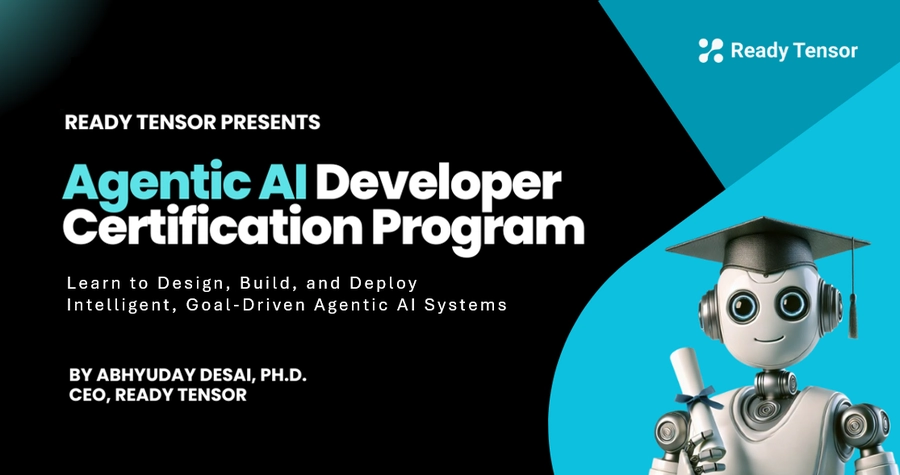

--DIVIDER--

Welcome to the **Agentic AI Developer Certification Program** by Ready Tensor! This is a **100% FREE** 12-week, hands-on learning journey where you'll design, build, and deploy intelligent, goal-driven AI systems.

--DIVIDER--

# What You'll Learn

This program is structured into three comprehensive modules, each culminating in a practical, portfolio-worthy project:

- **Module 1 (Weeks 1–4): Foundations of Agentic AI**
  Explore core concepts including agent architectures, retrieval-augmented generation (RAG), and tool use. You'll build your first project—a question-answering assistant.

- **Module 2 (Weeks 5–8): Architecting Agentic Workflows**
  Build collaborative, tool-using AI systems. In this module, you’ll design dynamic agents, implement multi-agent workflows, and integrate external tools using protocols like MCP. Your project will showcase a working multi-agent system that solves a real problem through coordination and orchestration.

- **Module 3 (Weeks 9–12): Real-World Readiness**
  Learn to test, secure, deploy, and monitor your agentic systems with guardrails, logging, and lightweight hosting. Finish with a production-grade, portfolio-ready final project.

--DIVIDER--

# What You’ll Earn

Participants who successfully complete the program will receive:

## 🏆 Certificates of Completion

You’ll earn **one certificate for each module** upon completing its associated project. After completing all three modules and meeting the program requirements, you’ll receive a **final certificate** recognizing your full certification as an **Agentic AI Developer**.

## 🎖️ Digital Badges

In addition to certificates, you’ll receive **four digital badges**—one for each module and one for completing the full program. These badges will be displayed on your **Ready Tensor profile page** and can be used to showcase your achievements on LinkedIn or other professional platforms.

> _Badges and certificates signal real-world, project-based competency in agentic AI systems._

## 👇 Sample Certificate and Badge

--DIVIDER--

# How the Program Works

This 12-week program is divided into three modules, each lasting four weeks. Each module culminates in a hands-on project that you will build and submit. Each week follows a consistent and engaging format:

- **Weekly Lessons**: Essential readings, publications, and templates provided weekly to deepen your understanding and guide your projects. Some lessons include videos with quizzes, expert commentary, and code walkthroughs.
- **Community Engagement**: Use [Discord](https://discord.gg/EsVfxNdUTR) for ongoing discussions, community Q\&A, and team collaboration.
- **Project Submissions**: You’ll submit three main projects, one per module, individually or as part of a team (max 5 people).
- **Project Reviews**: Each project is reviewed independently, so you can complete and submit modules at your own pace. Your submission will be evaluated in the next available cohort based on when you submit (see **Monthly Cohorts and Rolling Submissions** section below).
- **Free Certification**: The certification program is completely free. All participants who complete the requirements for all 3 projects will receive an official **Agentic AI Developer Certificate**.

--DIVIDER--

# How to Enroll

Follow these steps to join the program:

1.  **Register for a free account** on Ready Tensor (if you don't have one already). [Sign up here](https://app.readytensor.ai/signup).
2.  **Enroll in the program** by visiting the [`Ready Tensor Certifications` hub](https://app.readytensor.ai/hubs/ready_tensor_certifications).
3.  Click the “Join Hub” button at the top of the page. That's it - you are part of the program!

--DIVIDER--

---

:::info{title="Info"}
If you want to start with the lessons - you can find them here:

[🏠 All Lessons](https://app.readytensor.ai/hubs/ready_tensor_certifications)

We recommend that you bookmark the page above.
:::

---

--DIVIDER--

# Monthly Cohorts and Rolling Submissions

This certification program follows a **monthly cohort model**. You can begin learning anytime, but your **project submission deadlines** determine which cohort you're part of.

To be evaluated in a given cohort, simply submit each module’s project by the listed due date.

| Cohort Starting | Starts       | Module-1 Project Due | Module-2 Project Due | Module-3 Project Due |
| --------------- | ------------ | -------------------- | -------------------- | -------------------- |
| May 2025        | May 19, 2025 | Jun 13, 2025         | Jul 11, 2025         | Aug 08, 2025         |
| June 2025       | Jun 16, 2025 | Jul 11, 2025         | Aug 08, 2025         | Sep 05, 2025         |
| July 2025       | Jul 14, 2025 | Aug 08, 2025         | Sep 05, 2025         | Oct 03, 2025         |
| Aug. 2025       | Aug 11, 2025 | Sep 05, 2025         | Oct 03, 2025         | Oct 31, 2025         |
| Sept. 2025      | Sep 08, 2025 | Oct 03, 2025         | Oct 31, 2025         | Nov 28, 2025         |
| Oct. 2025       | Oct 13, 2025 | Nov 07, 2025         | Dec 05, 2025         | Jan 02, 2026         |

--DIVIDER--

:::info{title="Info"}

 <h2>Missed Project Deadline? Submit in the Next Cohort</h2>
 
  If you miss a project deadline for your current cohort, you can still submit it by the next cohort’s due date and it will be reviewed in that cycle. You won’t lose your progress.
 
 :::

--DIVIDER--

# Free Certification Process

The certification program is completely free. All participants who complete the requirements will receive an official **Agentic AI Developer Certificate**.

To earn your **Agentic AI Developer Certificate**, you must:

- Complete and submit all three hands-on projects: one for each module.
- Publish each completed project **publicly on the Ready Tensor platform**, including:

  - Comprehensive documentation
  - A link to your code repository

- Achieve at least a **70% score per project** based on the evaluation criteria provided in the **AAIDC Project Evaluation Criteria.pdf**.

--DIVIDER--

:::info{title="Project Reviews"}
Each project is reviewed independently, so you can complete and submit modules at your own pace. Your submission will be evaluated in the next available cohort based on when you submit.
:::

--DIVIDER--

# Program Curriculum--DIVIDER--

 <h2>Module 1: Foundations of Agentic AI (Weeks 1–4)</h2>
 
 Lays the groundwork for understanding and constructing agentic systems.
 
 <h3>Week 1: Introduction to Agentic AI Systems</h3>
 
 - What is Agentic AI? Definitions, terminology, and motivations
 - Core Components of Agentic AI
 - Real-world use cases and emerging trends
 - Tools and Frameworks
 - Differentiation of Agents and Workflows
 
 <h3>Week 2: Prompts, Embeddings and RAG </h3>
 
 - Basic prompting
 - Introduction to RAG systems
 - Vector databases and embedding models (FAISS, Chroma, etc.)
 
 <h3>Week 3: Hands-On with LLM calls, workflows and RAG (June 02, 2025)</h3>
 
 - Making your first LLM call
 - Building a Workflow
 - Building a RAG system
 
 <h3>Week 4: Project 1 - Build a RAG-Powered AI App</h3>
 
 - **Project-focused week with no new video lectures or required readings**
 - Participants work on building a question-answering or document-assistant app
 - Chain design: Prompt + Retrieval + Response
 - Integration with a vector store and basic evaluation loop
 - Optional: Add memory, tool usage, or intermediate reasoning
 - Deliverable: A simple RAG-based agent system with working retrieval and output
- _Note: Participants may begin project work earlier during Weeks 2–3 if desired_

--DIVIDER--

 <h2>Module 2: Architecting Agentic AI Systems (Weeks 4–8)</h2>
 
 Focuses on building autonomous and collaborative agents using modular and extensible systems.
 
 <h3>Week 5: Agent Architectures & Planning Techniques</h3>
 
 - When and why to move from static LLM workflows to adaptive agent-based systems
 - Introduction to LangGraph for building flexible, stateful agent workflows
 - Step-by-step implementation of your first LangGraph system — a joke-telling bot
 - Building agent behaviors with loops like Writer–Critic for self-evaluation
 - Visualizing agent behavior and debugging with LangSmith
 - Giving agents tool-using abilities, from built-in tools to custom integrations
 
 <h3>Week 6: Multi-Agent Systems & Collaboration</h3>
 
 - Design patterns for building collaborative multi-agent AI systems
 - When to use agents vs. traditional tools in real-world applications
 - Step-by-step walkthrough of a tag extraction system powered by multiple agents and workflows
 - How to assign the right tasks to the right agents — and avoid common design pitfalls
 - Introduction to MCP (Model Context Protocol) for integrating external tools and services
 - Hands-on experience connecting and building with MCP in your own AI workflows
 
 
 <h3>Week 7: Advanced Agent Evaluation Techniques</h3>
 
 - Why traditional testing falls short for AI systems that reason, act, and adapt
 - Seven practical methods for evaluating agentic AI, including LLM-as-judge, red teaming, and human reviews
 - How to choose the right metrics based on what your AI system is designed to do
 - Creating test sets, pipelines, and custom metrics using frameworks like RAGAS and DeepEval
 - Hands-on evaluation of a real agentic system to apply everything you've learned
 
 <h3> Week 8: Project 2 - Build a Multi-Agent System</h3>
 
 - **Project-focused week with no new lectures or required readings**
 - Build a working multi-agent system with at least 3 specialized agents
 - Design agents that communicate, coordinate, and solve a meaningful problem together
 - Use an orchestration framework (e.g. LangGraph, CrewAI, AutoGen) to manage agent workflows
 - Integrate at least 3 different tools to extend agent capabilities (e.g. web search, file parsing, API calls)
 - Optional: Add human-in-the-loop interactions, use MCP for tool communication, or define evaluation metrics
 - Deliverable: A functional multi-agent system demonstrating real-world collaboration and tool use
- _Note: Participants may begin project work earlier during Weeks 6–7 if desired_

--DIVIDER--

 <h2>Module 3: Preparing Agentic AI for Real-World Use (Weeks 9–12)</h2>
 
 Equips participants with essential skills for building safe, evaluable, and deployable systems.
 
 <h3>Week 9: Testing, Safety, and Guardrails for Agentic Systems</h3>
 
 * Unit and integration testing of LLM workflows using pytest
 * Structure, behavior, and safety validation strategies
 * Guardrails for runtime input/output validation
 * Secure development: threat modeling, attack prevention
 * Risk mitigation through ethical safeguards and tools like Giskard
 
 <h3>Week 10: Deployment Planning & Production Preparation</h3>
 
 * Lightweight Deployment with FastAPI — Making Your Agent Web-Ready
 * Hosting options: Render, Streamlit, Gradio (suitable for student, demo, and portfolio use)
 * Building Resilient Agents — Timeouts, Retries, and Graceful Failures
 * Production Handoff Documentation — Setting Up Ops Teams for Success
 * Packaging Options — Choosing Between Portfolio Demos and Production Deployments
 
 <h3>Week 11: Monitoring, Resilience & Real-World Readiness</h3>
 
 * Monitoring Agentic Systems — Metrics, Logs, and Traces Explained
 * Debugging Silent Failures — Diagnosing Behavior Drift in Production
 * Choosing the Right Observability Stack — LangSmith, OpenTelemetry, and More
 * Data Privacy and Compliance — GDPR, HIPAA, and Developer Responsibilities
 * Proprietary vs. Open-Weight Models — Hosting Tradeoffs and Deployment Options
 * Real-World Agentic Development Blueprints — From Planning to Deployment
 
 <h3>Week 12: Final Project – Production-Aware Agentic AI System</h3>
 
 * Project-focused week with no new video lectures or required readings
 * Final milestone: Transform your Week 8 multi-agent system into a production-grade application
 * Add safety features, structured logging, and failure-handling logic
 * Build a user-facing web app using Gradio, Streamlit, or similar UI framework
 * Include a full test suite (unit, integration, and system tests with 70%+ core coverage)
 * Write professional documentation: architecture overview, deployment instructions, and maintenance guidance
 * Deliverable: A robust, portfolio-ready agentic AI system aligned with real-world engineering standards
 * _Note: Participants may begin final project work earlier during Weeks 10–11 if desired_

--DIVIDER--

# Project Details

Each project is designed to be a portfolio piece, showcasing your skills and understanding of agentic AI systems. You can find detailed descriptions here:

- Module 1 Project: [Build a RAG-Powered AI App](https://app.readytensor.ai/publications/4n07ViGCey0l)
- Module 2 Project: [Build a Multi-Agent System](https://app.readytensor.ai/publications/gUPu2RlgjzNy)
- Module 3 Project: [Productionize Your Agentic System](https://app.readytensor.ai/publications/DSYotKAAvcxy)

--DIVIDER--

# Team-Based Learning

We strongly encourage participants to complete projects in teams (3–4 members recommended). This mirrors real-world professional workflows and maximizes skill diversity:

- **AI/ML Theory Expert**: Knowledge of embeddings, transformers, and applied AI concepts.
- **Programming Expert**: Skilled in Python, clean coding, and version control.
- **Documentation Expert**: Adept at creating polished documentation and visuals.
- **UI Expert**: Experienced in building professional-quality apps using Streamlit or Gradio.

Solo projects are permitted but strongly discouraged. Team formation and collaboration are facilitated via our [Discord](https://discord.gg/EsVfxNdUTR) community.

--DIVIDER--

# What's Not Covered

This certification focuses specifically on agentic system development with existing models and APIs. It does **not** include:

- Model training or fine-tuning
- Self-hosting of foundation models
- Full-scale ML-Ops or CI/CD pipelines
- Enterprise-level security frameworks
- Advanced front-end development

--DIVIDER--

---

[🏠 Home - All Lessons](https://app.readytensor.ai/hubs/ready_tensor_certifications)

[➡️ Next - Welcome & Orientation](https://app.readytensor.ai/publications/kwFKTldV27nA)

---
