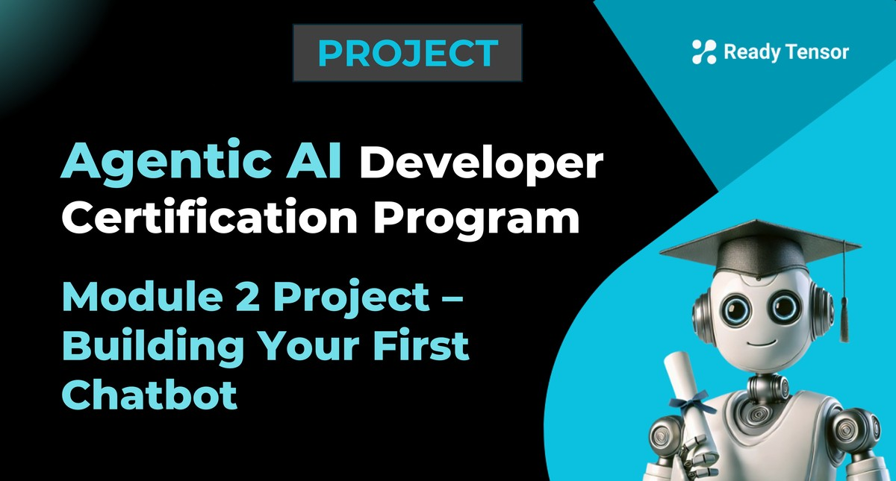

--DIVIDER--

---

[🏠 Home - All Lessons](https://app.readytensor.ai/hubs/ready_tensor_certifications)

[⬅️ Previous - Welcome & Orientation](https://app.readytensor.ai/publications/kwFKTldV27nA)
[➡️ Next - What is Agentic AI](https://app.readytensor.ai/publications/g8QivAEShqgw)

---

--DIVIDER--

# Project Context

This is the first of three core projects in the Agentic AI Developer Certification Program. These projects are the main deliverables you’ll complete to earn your certificate of completion.

Each project is designed to apply what you’ve learned in that module through hands-on implementation. This one wraps up Module 1 by having you build a working RAG-based assistant that retrieves answers from a custom knowledge base.

---

--DIVIDER--

# Project Objectives

In this project, you’ll build a simple question-answering assistant that pulls answers from a custom document set using RAG (Retrieval-Augmented Generation). It’s your first hands-on project in the Agentic AI Developer Certification Program.

You’ll use LangChain and a vector store like FAISS or Chroma (or their alternatives) to connect a prompt → retriever → response flow.

---

--DIVIDER--

# 🛠️ What You’ll Build

You’ll build a simple RAG-powered assistant that answers questions based on a custom document set. Here’s what’s expected:

- A LangChain-based pipeline that connects:

  - **Prompt formulation**
  - **Vector store retrieval** (e.g., FAISS, Chroma, or alternatives)
  - **LLM-generated response**

- Document ingestion into the vector store
- Basic UX for interaction (CLI, notebook, or minimal UI)
- Run a few example queries to test retrieval and response quality

**Optional enhancements:**

- Add session-based memory or intermediate reasoning steps (e.g., ReAct or CoT-style chaining)
- Include basic logging or observability if you’d like to go further

---

--DIVIDER--

# ▶️ Watch the Walkthrough

Here’s a quick video outlining the project requirements and showing an example of what you’ll build:

:::youtube[Title]{#TenMXTgtjfk}

---

--DIVIDER--

# 💡 Example Use Cases & Datasets

Not sure what to build your assistant for? Here are a few project ideas to spark inspiration:

## 📄 Ready Tensor Publication Explorer

Build a conversational assistant that helps users explore the contents of Ready Tensor publications by asking natural language questions.

Use a sample of 20-50 diverse publications from the platform as your knowledge base. You can find a dataset of a sample of our publications on [Google Drive here](https://drive.google.com/drive/folders/1HAqLXL2W-sh8hqoBb1iSauJ_0wZVRxB9?usp=sharing).

:::caution{title="Verify Licenses"}
If you scrape or copy/paste publications from the Ready Tensor platform yourself, make sure to check the license for each one to ensure the author has granted permission for reuse.
:::

Build a chatbot that can answer questions from readers such as:

- What’s this publication about?
- What models or tools were used?
- Any limitations or assumptions?

> We’ll demo a working version of this (see video above) - a conversational bot that helps users explore any publication on the platform.

## 📚 LangChain or LangGraph Docs Bot

Build a technical assistant that can answer developer questions using content from the LangChain or LangGraph documentation.

Select and ingest a focused portion of the docs (don’t overload it — 20-50 pages is enough). Your bot should be able to respond to questions like:

- How do I define a custom agent?
- What’s the role of memory in LangGraph?

## 🌍 Topic-Specific Wikipedia Bot

Pull a collection of pages particular to a topic (such as python, LLMs, or deep learning), embed them into a vector store, and build a bot that can answer user questions as if it were an expert on that subject.

If you’re scraping or downloading content, make sure you comply with Wikipedia’s content usage policies and only use a small, well-scoped dataset.

## 🧭 You're Not Limited to These!

These are just a few starting points. Feel free to explore any use case that interests you. Just make sure you have the right to use the data you choose, and respect any licenses or usage restrictions that come with it.

---

--DIVIDER--

:::info{title="Submission Deadlines"}

Your Module 1 project will be reviewed in the cohort that matches your submission date. Submit your project by **any one of the following deadlines**:

- ✅ June 13, 2025 — 11:59 PM UTC
- ✅ July 14, 2025 — 11:59 PM UTC
- ✅ August 08, 2025 — 11:59 PM UTC
- ✅ September 05, 2025 — 11:59 PM UTC
- ✅ October 03, 2025 — 11:59 PM UTC
- ✅ October 31, 2025 — 11:59 PM UTC

If you miss a date, just submit before the next one — your project will be reviewed in the next cohort cycle.

:::

---

--DIVIDER--

# ✅ Submission Checklist

To complete this project, you need to submit **two deliverables**:

 <h2> 1. 📝 Project Publication </h2>
 
 Create a short publication on the Ready Tensor platform that:
 
 - Describes your project, what it does, and how it works
 - Follows best practices from our **Technical Evaluation Rubric** for the
   _Tool / App / Software Development_ category
 - Meets at least **70% of the listed criteria**
 
 📄 [Publication: Technical Evaluation Rubric](https://app.readytensor.ai/publications/WsaE5uxLBqnH)
 
 Check the document titled **Publication Evaluation Criteria Reference Guide.pdf** uploaded in this publication above.
 
 > Note: This rubric is general-purpose. You still need to follow the project-specific expectations described above (e.g. use of retrieval, optional memory/tool extensions, etc.)
 
 <h2>  2. 🗂️ Project GitHub Repository </h2>
 
 Submit a repo that:
 
 - Contains clean, working code for your RAG-based assistant
 - Includes setup instructions, sample inputs, and outputs
 - Meets the **“Essential” level** of our repo evaluation rubric
 - Satisfies at least **70% of the Essential criteria**
 
 📄 [Repository Evaluation Rubric](https://app.readytensor.ai/publications/0llldKKtn8Xb)

--DIVIDER--

---

[🏠 Home - All Lessons](https://app.readytensor.ai/hubs/ready_tensor_certifications)

[⬅️ Previous - Welcome & Orientation](https://app.readytensor.ai/publications/kwFKTldV27nA)
[➡️ Next - What is Agentic AI](https://app.readytensor.ai/publications/g8QivAEShqgw)

---
