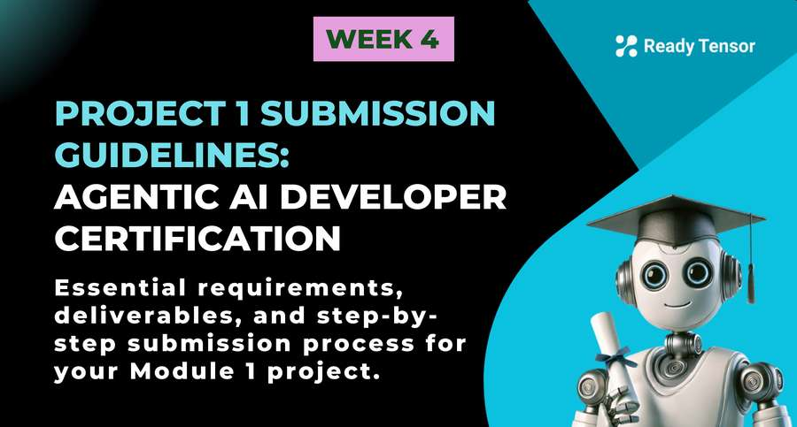

--DIVIDER--

---

[🏠 Home - All Lessons](https://app.readytensor.ai/hubs/ready_tensor_certifications)

[⬅️ Previous - RAG Implementation](https://app.readytensor.ai/lessons/IBOMURRgN8Dn)
[➡️ Next - Module 2 Project Requirements](https://app.readytensor.ai/lessons/gUPu2RlgjzNy)

---

--DIVIDER--

Congratulations on completing Module 1 of the Agentic AI Developer Certification Program! Now it's time to demonstrate your learning through Project 1. This guide walks you through the exact steps to submit your RAG-based AI assistant project successfully.--DIVIDER--:::youtube[Title]{#6lLxyz6MDSU}

--DIVIDER--

# 📋 Technical Requirements

Before submitting, ensure your project meets these core requirements:

- **RAG-based AI assistant application** - Your system must use Retrieval-Augmented Generation
- **Vector database integration** - Incorporate a vector store (FAISS, Chroma, or alternatives) for document retrieval
- **Document corpus embedding** - Embed a collection of documents (Ready Tensor publications, Wikipedia articles, or other permitted sources)
- **Working retrieval and response system** - Demonstrate functional prompt → retrieval → response pipeline using LangChain

---

--DIVIDER--

:::info{title="IMPORTANT"}

<h2>Submission Deadlines ⏰</h2>

Your project will be reviewed in the month that matches your submission date.  
Submit your Project 1 by any one of the following deadlines:

- ✅ September 05, 2025 — 11:59 PM UTC
- ✅ October 03, 2025 — 11:59 PM UTC
- ✅ November 03, 2025 — 11:59 PM UTC
- ✅ December 01, 2025 — 11:59 PM UTC
- ✅ January 05, 2026 — 11:59 PM UTC
- ✅ February 02, 2026 — 11:59 PM UTC

If you miss the due date for the month, no problem — just submit before the next one and your project will be reviewed in that month's review cycle.

:::

---

--DIVIDER--

# 🚀 Step-by-Step Submission Process

<h2>Before You Begin</h2>

Make sure you’ve done the following:

1. **Have a Ready Tensor account** – If you’re not already registered, [sign up here](https://app.readytensor.ai/signup).
2. **Be enrolled in the program** – If you haven’t joined yet:

   - Go to the [Certifications page](https://app.readytensor.ai/hubs/ready_tensor_certifications)
   - Click **“Join Now”** near the top (next to the page title)
   - You’ll be enrolled immediately.
     _(If you don’t see the Join Now link, you’re already enrolled.)_

<h3>Step 1: Create Your Publication </h3>

The **team lead** creates a new publication on the Ready Tensor platform describing your project. Create the publication in the team lead's personal hub. Note that publications from individual hubs are still public and can include co-authors.

<em>⚠️ Create the publication in the team lead's personal hub (not in the hub named `Ready Tensor Certifications`).</em>

<h3>Step 2: Select the Module</h3>

In the **Create Publication** form, choose the correct **Module** from the dropdown (e.g., AAIDC - Module 1 for this project).

- If you don’t see the dropdown, you’re not enrolled — see the instruction on how to enroll above.

<h3>Step 3: Add Co-Authors </h3>

Don't forget to add your teammates as co-authors to the publication. The team lead's name will appear as the first author.

<h3>Step 4: Link Your Code Repository </h3>

Upload your GitHub repository URL in the **"Code"** section of the publication. Evaluators will access your code through this link.

:::warning{title="Warning"}
Please store API keys and sensitive data in a .env file, ensure it's listed in .gitignore, and use a .env_example to share required variable names securely.
:::

<h3>Step 5: Follow Best Practices </h3>

Ensure your publication follows Ready Tensor's best practices for AI/ML project documentation. Refer to our published guidelines for detailed requirements.

<h3>Step 6: Upload Supplementary Files </h3>

You can upload any additional relevant files (PDFs, datasets, documentation) to support your submission.

<h3>Step 7: Final Review and Submit </h3>

Complete your submission before the deadline!

---

--DIVIDER--

:::tip{title="Bonus Tip"}
You are encouraged to include a video demo of your app in your publication to enhance clarity and showcase your work more effectively. While not required, this is strongly recommended as videos serve as valuable portfolio additions. Record your application's workflow, optionally include a brief presentation, upload to YouTube, and attach the link to your Ready Tensor publication to improve readability and overall impact.
:::

---

--DIVIDER--

# 📝 Publication Requirements Checklist

- [ ] Published on Ready Tensor platform
- [ ] Correct Module selected in the dropdown (i.e., AAIDC - Module 1)
- [ ] Created by the team lead
- [ ] All teammates added as co-authors
- [ ] GitHub repository linked under "Models" section
- [ ] Repository follows best practices for AI/ML code repositories
- [ ] Documentation follows AI/ML project best practices

---

--DIVIDER--

# 💻 Code Repository Requirements

Your GitHub repository must:

- Follow best practices for AI/ML code development (see our published guidelines)
- Be reproducible and runnable locally by our evaluation team
- Include clear setup instructions, sample inputs, and expected outputs
- Score 70% or higher on our [repository evaluation rubric](https://app.readytensor.ai/lessons/0llldKKtn8Xb)

:::warning{title="Warning"}
Please ensure that **API keys** and other sensitive information are not exposed in your main GitHub repository or shared publicly. Instead, store such data in a .env file and make sure it is included in your .gitignore to prevent accidental uploads. For reproducibility, you should provide a .env_example file that outlines the required environment variables without revealing any real values. This practice helps maintain security while allowing others to understand how to set up the project properly. Thank you for following secure development practices.
:::

---

--DIVIDER--

# 🔍 Evaluation Process

After submission, our team will:

1.  Review your Ready Tensor publication
2.  Clone and run your GitHub repository locally
3.  Test the functionality of your RAG system
4.  Evaluate against our technical and documentation rubrics
5.  Provide feedback and certification status

---

--DIVIDER--

# 💡 Key Reminders

- **Module selection is mandatory:** Pick the correct Module from the dropdown when creating your project.
- **Team lead submits:** Only the team lead creates the publication
- **Code must run:** Ensure your repository is fully functional and reproducible
- **Meet the 70% threshold:** Both publication and code must meet minimum quality standards

---

--DIVIDER--

# 🤝 Need Help?

If you have questions about the submission process or need technical assistance, reach out to our team on Discord. We're here to help you succeed!

---

--DIVIDER--

# 📚 Additional Resources

- [Repository Best Practices Guide](https://app.readytensor.ai/lessons/0llldKKtn8Xb)
- [Technical Publication Rubric](https://app.readytensor.ai/lessons/WsaE5uxLBqnH)
- [Ready Tensor Publication Best Practices](https://app.readytensor.ai/lessons/SBgkOyUsP8qQ)

Good luck with your Project 1 submission! We're excited to see the RAG-based AI assistants you've built using the foundations from Module 1.

--DIVIDER--

---

[🏠 Home - All Lessons](https://app.readytensor.ai/hubs/ready_tensor_certifications)

[⬅️ Previous - RAG Implementation](https://app.readytensor.ai/lessons/IBOMURRgN8Dn)
[➡️ Next - Module 2 Project Requirements](https://app.readytensor.ai/lessons/gUPu2RlgjzNy)

---
