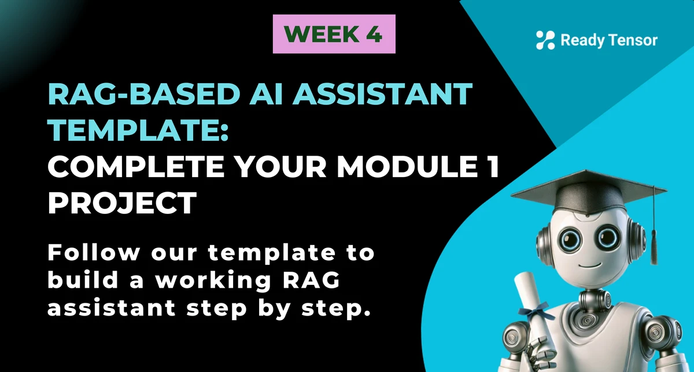

<!-- RT_DIVIDER -->

---

[🏠 Home - All Lessons](https://app.readytensor.ai/hubs/ready_tensor_certifications)

[⬅️ Previous - Lesson 4 - RAG Implementation](https://app.readytensor.ai/lessons/IBOMURRgN8Dn)
[➡️ Next - Project 1 Submission Guidelines](https://app.readytensor.ai/lessons/BblNcQTBi5Os)

---

<!-- RT_DIVIDER -->

# TL;DR

This is your first major project in the certification program. You’ll be building a **Retrieval-Augmented Generation (RAG) assistant** — an AI that can answer questions about your own documents.

To make the starting point less intimidating, we’ve prepared a **project template, i.e., GitHub repo with scaffolded code**, and a **video walkthrough** that shows you exactly how to complete it. Your job is to fill in a handful of missing functions that bring the system to life.

By the end, you’ll have a working Q\&A assistant — think _ChatGPT, but grounded in your knowledge base_.

---

<!-- RT_DIVIDER -->

# Why We’re Giving You a Template

Starting a big project from scratch can feel overwhelming. To help you past that “where do I begin?” moment, we’ve provided a **ready-to-use template**.

The template isn’t a complete project — instead, it gives you:

- A clear project structure with `app.py`, `vectordb.py`, and a `data/` folder
- Vector database integration (ChromaDB by default)
- Multi-LLM support (OpenAI, Groq, or Google)
- Sentence Transformers for embeddings

All the heavy lifting is in place. What’s missing are the core functions you’ll implement to make the assistant work.

---

<!-- RT_DIVIDER -->

# What You’ll Build

Your task is to complete the system by adding the logic for:

1.  Loading your own documents
2.  Splitting them into chunks for search
3.  Creating embeddings and storing them in the vector database
4.  Searching for relevant chunks when a user asks a question
5.  Designing a prompt template that combines context with the user’s query
6.  Connecting it all into a query pipeline that produces an answer

In other words: the template gives you the **skeleton**, and you’ll add the **muscles and movement**.

---

<!-- RT_DIVIDER -->

**🎥 Video Walkthrough: Implementing Your RAG Assistant**

In this video, we guide you through the project template and show you exactly how to bring it to life. You’ll see how to:

- Set up your environment and API keys
- Add your own documents to the `data/` directory
- Implement the missing functions in `app.py` and `vectordb.py`
- Choose chunking strategies and embedding models
- Run queries and test your assistant end to end

:::youtube[Title]{#-401pw2tYj0}

---

<!-- RT_DIVIDER -->

# What You’ll Build

By completing the template, you’ll have an AI assistant that can:

- Load and process your own documents
- Break them into chunks for semantic search
- Store and retrieve them from a vector database
- Use an LLM to generate contextual answers

---

<!-- RT_DIVIDER -->

# What’s Already Done for You

The template handles:

- Multi-LLM support (OpenAI, Groq, Google)
- ChromaDB integration, ready out of the box
- Sentence Transformers embeddings
- Clean structure and environment setup

All the infrastructure is ready. You just add the core logic.

---

<!-- RT_DIVIDER -->

# Success Criteria

You’ve completed the project when:

- You can add your own documents to the `data/` folder
- The system loads, chunks, embeds, and stores them
- Queries return relevant results
- The assistant generates meaningful, contextual answers
- You can switch between LLM providers via environment variables

---

<!-- RT_DIVIDER -->

# Ready to Start?

Clone the repo, watch the walkthrough, and implement one function at a time. Test as you go — and remember, the template is here to help you overcome the blank-page problem.

This is your first step toward building real agentic systems. Have fun with it! 🚀

<!-- RT_DIVIDER -->

---

[🏠 Home - All Lessons](https://app.readytensor.ai/hubs/ready_tensor_certifications)

[⬅️ Previous - Lesson 4 - RAG Implementation](https://app.readytensor.ai/lessons/IBOMURRgN8Dn)
[➡️ Next - Project 1 Submission Guidelines](https://app.readytensor.ai/lessons/BblNcQTBi5Os)

---
