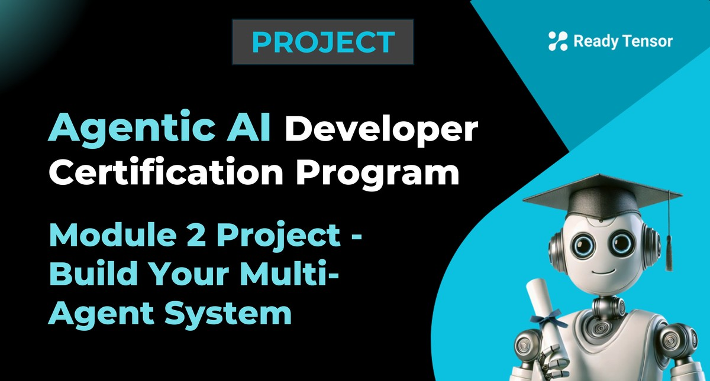

--DIVIDER--

---

[🏠 Home - All Lessons](https://app.readytensor.ai/hubs/ready_tensor_certifications)

[⬅️ Previous - Project 1 Submission Guidelines](https://app.readytensor.ai/publications/BblNcQTBi5Os)
[➡️ Next - Week 5 Preview](https://app.readytensor.ai/publications/jcd9IGoIp9sl)

---

--DIVIDER--

# Project Context

This is the second of three core projects in the Agentic AI Developer Certification Program. These projects are the main deliverables you'll complete to earn your certificate of completion.

Each project is designed to apply what you've learned in that module through hands-on implementation. This project wraps up Module 2 by having you build a working multi-agent system that demonstrates the key concepts from Weeks 5-7: transitioning from workflows to agents and designing multi-agent collaboration using orchestration frameworks.

---

--DIVIDER--

# Project Objectives

In this project, you'll design and implement a multi-agent system that demonstrates your mastery of the core Module 2 concepts:

- **Tool Integration**: Show how agents can extend their capabilities through built-in and custom tools
- **Multi-Agent Collaboration**: Design agents with distinct roles that communicate and coordinate effectively
- **Agent Orchestration**: Use an orchestration framework (LangGraph, CrewAI, AutoGen, or similar) for workflow management

---

--DIVIDER--

# What You’ll Build 🛠️

You'll build a multi-agent system that incorporates the key learning objectives from Module 2. Your system must include:

## **Required Components:**

**1. Multi-Agent System (minimum 3 agents)**

- At least 3 agents with distinct roles working together
- Clear communication or coordination between agents
- Use an orchestration framework (LangGraph, CrewAI, AutoGen, or similar)

**2. Tool Integration**

- Your system should integrate at least 3 different tools
- Tools can be built-in (LangChain tools) or custom implementations
- Tools should extend capabilities beyond basic LLM responses (e.g., web search, math calculations, file processing, API calls, etc.)

## **Optional Enhancements:**

- Human-in-the-loop interactions
- Use of communication protocol such as MCP
- Formal evaluation metrics and benchmarking against baselines

---

--DIVIDER--

# Watch the Walkthrough ▶️

Get a quick overview of what’s expected in the Module 2 project, along with a sample multi-agent system to inspire your own implementation.

:::youtube[Title]{#f0Rr97RxwN8}

---

--DIVIDER--

# Example Use Cases & Scenarios💡

Your multi-agent system should solve a meaningful problem that benefits from multiple agents working together. The problem should be complex enough to require coordination, but scoped to be doable in a couple of weeks. Here are some example directions to consider:

---

## Example 1: **Publication Assistant for AI Projects** 📘

Build a system that helps users improve how their AI/ML project is presented for public sharing. The user provides a **GitHub repo** and (optionally) a **brief project description**. Your system returns practical suggestions to enhance discoverability, clarity, and completeness.

**Sample tasks your system might perform:**

- Recommend a better project **title** or **summary**
- Suggest relevant **tags or categories**
- Identify **missing sections** or unclear parts of the README
- Propose visual or structural enhancements (e.g., diagrams, layout)

> 🧠 **Agents you might consider (not all are needed)**:
>
> > Repo Analyzer – parses and interprets README, code, and structure
> > Metadata Recommender – suggests tags, categories, and keywords
> > Content Improver – proposes better titles, summaries, or intros
> > Reviewer / Critic – checks for missing sections or unclear areas
> > Fact-Checker – verifies claims or suggestions against actual repo content

> 🛠️ **Tools you might use**:
>
> > Repo Reader / Parser · RAG Retriever · Image Generator · Web Search · Keyword Extractor · arXiv or Google Scholar Tool

You can organize agents however you like—by task, content type, or validation step—as long as they collaborate toward the shared goal.

---

## Example 2: **Cross-Publication Insight Assistant** 🔍

Build a system that helps users explore patterns and trends across multiple AI/ML projects. The input is a **list of GitHub repos or Ready Tensor publications**, plus an optional user query (e.g., tool usage, evaluation methods, task types).

Support **at least two** of the following query patterns, each with **multiple working examples**:

- **Aggregate (Map-Reduce)** – e.g., “What % of these projects use LangGraph?”
- **Compare & Contrast** – e.g., “How do CrewAI and LangChain projects differ?”
- **Find & Summarize (RAG)** – e.g., “Show me projects that use vector DBs”

> 🧠 **Agents you might need**:
>
> > Project Analyzer – inspects individual repos/publications for relevant attributes
> > Trend Aggregator – tallies, groups, or ranks signals across projects
> > Comparator – compares two project groups based on defined criteria
> > Summarizer – generates clear takeaways for the user
> > Fact-Checker – ensures outputs are grounded in project content
>
> 🛠️ **Tools you might use**:
>
> > Repo Reader / Parser · Keyword/Tag Extractor · RAG Retriever · Web Search

---

## You're Not Limited to These Ideas for Projects 🧭

Feel free to explore other collaborative use cases. Just make sure your system uses multiple agents to solve a shared problem that benefits from reasoning, tool use, or coordination beyond simple retrieval.

---

--DIVIDER--

:::info{title="Submission Deadlines"}

Your Module 2 project will be included in the review cycle for the month that matches your submission date.  
To be assessed in that month’s cycle, submit your project **by one of the following deadlines**:

- ✅ August 11, 2025 — 11:59 PM UTC
- ✅ September 05, 2025 — 11:59 PM UTC
- ✅ October 03, 2025 — 11:59 PM UTC
- ✅ November 03, 2025 — 11:59 PM UTC
- ✅ December 01, 2025 — 11:59 PM UTC

If you miss a deadline, submit before the next month’s due date to be reviewed in that cycle.

Each review cycle typically takes up to **2 weeks** from the submission deadline, including feedback from the reviewer(s) and any updates or iterations you make in response.

:::

---

--DIVIDER--

# Submission Checklist ✅

To complete this project, you need to submit two deliverables:

## Project Publication 📝

Create a short publication on the Ready Tensor platform that:

- Describes your project, what it does, and how it works
- Follows best practices from our Technical Evaluation Rubric for the
  _Tool / App / Software Development_ category
- Meets at least 70% of the listed criteria  
  📄 [Publication: Technical Evaluation Rubric](https://app.readytensor.ai/publications/WsaE5uxLBqnH)

:::info{title="Note"}
The rubric is general-purpose. You still need to meet project-specific expectations (e.g. use of multiple agents, orchestration, etc).
:::

## Project GitHub Repository 🗂️

Submit a repo that:

- Contains clean, working code for your multi-agent system
- Defines roles and communication flows between agents
- Includes setup instructions and sample interactions
- Meets the “Essential” level of our repo evaluation rubric
- Satisfies at least 70% of the Essential criteria  
  📄 [Repository Evaluation Rubric](https://app.readytensor.ai/publications/0llldKKtn8Xb)

--DIVIDER--

---

[🏠 Home - All Lessons](https://app.readytensor.ai/hubs/ready_tensor_certifications)

[⬅️ Previous - Project 1 Submission Guidelines](https://app.readytensor.ai/publications/BblNcQTBi5Os)
[➡️ Next - Week 5 Preview](https://app.readytensor.ai/publications/jcd9IGoIp9sl)

---
