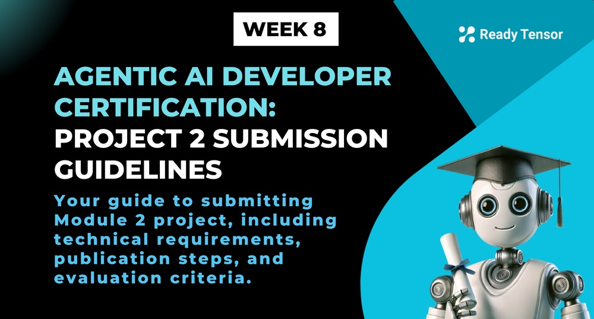

--DIVIDER--

---

[🏠 Home - All Lessons](https://app.readytensor.ai/hubs/ready_tensor_certifications)

[⬅️ Previous - A3 System Evaluation - Case Study](https://app.readytensor.ai/publications/t6q6c0SSuM0W)  
 [➡️ Next - Week 9 Preview](https://app.readytensor.ai/publications/h4GLp8hyNZDt)

---

--DIVIDER--

# 🎉 Congratulations on Reaching the Module 2 Submission!

Here's everything you need to know to complete your project and submit successfully.

In this project, you'll apply everything you've learned in Module 2 to build a Multi-Agent System. Your submission should demonstrate your ability to design and implement a modular, composable team of agents that can collaborate effectively to solve a problem.

--DIVIDER--

# 📋 Technical Requirements

 <h3>Required Components:</h3>
 
 **1. Multi-Agent System (minimum 3 agents)**
 > - At least 3 agents with distinct roles working together
 > - Clear communication or coordination between agents
 > - Use an orchestration framework (LangGraph, CrewAI, AutoGen, or similar)
 
 **2. Tool Integration**
 > - Your system should integrate at least 3 different tools
 > - Tools can be built-in (LangChain tools) or custom implementations
 > - Tools should extend capabilities beyond basic LLM responses (e.g., web search, math calculations, file processing, API calls, etc.)
 
  
 
 <h3>Optional Enhancements:</h3>  
 
 - Human-in-the-loop interactions
 - Use of communication protocol such as MCP
 - Formal evaluation metrics and benchmarking against baselines
 
 For more information on Module 2 project requirements, see [here](https://app.readytensor.ai/publications/gUPu2RlgjzNy).
 
---

--DIVIDER--

:::info{title="IMPORTANT"}

 <h2>Submission Deadline ⏰ </h2>
 
 Your Module 2 project will be reviewed in the month that matches your submission date. Submit your project by **any one of the following deadlines**:
 
- ✅ August 11, 2025 — 11:59 PM UTC
- ✅ September 05, 2025 — 11:59 PM UTC
- ✅ October 03, 2025 — 11:59 PM UTC
- ✅ November 03, 2025 — 11:59 PM UTC
- ✅ December 01, 2025 — 11:59 PM UTC
 
 If you miss a date, just submit before the next one — your project will be reviewed in that month's review cycle.
 
 :::
 
---

--DIVIDER--

# 🚀 Step-by-Step Submission Process

**Step 1: Create Your Publication**  
 The **team lead** creates a new publication on the Ready Tensor platform describing your multi-agent system project. Use the team lead’s personal hub for the publication.

**Step 2: Add the Required Tag**  
 Add the tag `AAIDC-M2` to your publication to identify it as part of the certification program.

**Step 3: Add Co-Authors**  
 Include all teammates as co-authors. The team lead will be listed as the first author.

**Step 4: Link Your Code Repository**  
 Upload your GitHub repository URL in the "Code" section of the publication. Ensure your repository contains all code, configurations, and documentation needed to run the multi-agent system.

**Step 5: Follow Best Practices**  
 Adhere to Ready Tensor’s best practices for AI/ML project documentation and code repository management.

**Step 6: Upload Supplementary Files**  
 Optionally upload any additional files (e.g., diagrams, datasets, documentation) that support your submission.

**Step 7: Final Review and Submit**  
 Complete your submission before the deadline. Including a video demo of your multi-agent system is highly recommended to showcase its functionality and improve your portfolio.

--DIVIDER--

:::tip{title="Bonus Tip"}
You are encouraged to include a video demo of your app in your publication to enhance clarity and showcase your work more effectively. While not required, this is strongly recommended as videos serve as valuable portfolio additions. Record your application's workflow, optionally include a brief presentation, upload to YouTube, and attach the link to your Ready Tensor publication to improve readability and overall impact.
:::

--DIVIDER--

# 📝 Publication Requirements Checklist

- [ ] Published on Ready Tensor platform
- [ ] Includes the `AAIDC-M2` tag
- [ ] Created by the team lead
- [ ] All teammates added as co-authors
- [ ] GitHub repository linked under the "Code" section
- [ ] Repository follows AI/ML best practices
- [ ] Documentation clearly explains system design, agent roles, communication, and orchestration

--DIVIDER--

# 💻 Code Repository Requirements

- Follow AI/ML code development best practices
- Ensure the code is reproducible and runnable locally by evaluators
- Provide clear setup instructions, sample inputs, and expected outputs
- Securely handle API keys and sensitive data using `.env` and `.env_example` files
- Aim to score 70% or higher on the repository evaluation rubric

:::warning{title="Warning"}
Please ensure that **API keys** and other sensitive information are not exposed in your main GitHub repository or shared publicly. Instead, store such data in a .env file and make sure it is included in your .gitignore to prevent accidental uploads. For reproducibility, you should provide a .env_example file that outlines the required environment variables without revealing any real values. This practice helps maintain security while allowing others to understand how to set up the project properly. Thank you for following secure development practices.
:::

--DIVIDER--

# 🔍 Evaluation Process

- Review of your Ready Tensor publication
- Cloning and local execution of your GitHub repository
- Testing of multi-agent communication, memory sharing, and LangGraph orchestration
- Assessment against technical and documentation rubrics
- Feedback and certification status provided

--DIVIDER--

# 💡 Key Reminders

- **Tag is mandatory**: Include **TBD** in your publication
- **Team lead submits**: Only the team lead creates the publication
- **Code must run**: Ensure your repository is fully functional and reproducible
- **Meet quality standards**: Both publication and code must meet minimum quality thresholds

--DIVIDER--

:::tip{title="🤝 Need Help? "}
For questions or technical support, reach out to the Ready Tensor team on Discord. We are here to help you succeed!
:::

--DIVIDER--

# 📚 Additional Resources

- [Repository Best Practices Guide](https://app.readytensor.ai/publications/0llldKKtn8Xb)
- [Technical Publication Rubric](https://app.readytensor.ai/publications/WsaE5uxLBqnH)
- [Ready Tensor Publication Best Practices](https://app.readytensor.ai/publications/SBgkOyUsP8qQ)

_Good luck_ with your Module 2 submission! We look forward to reviewing your innovative multi-agent system.

--DIVIDER--

---

[🏠 Home - All Lessons](https://app.readytensor.ai/hubs/ready_tensor_certifications)

[⬅️ Previous - A3 System Evaluation - Case Study](https://app.readytensor.ai/publications/t6q6c0SSuM0W)  
 [➡️ Next - Week 9 Preview](https://app.readytensor.ai/publications/h4GLp8hyNZDt)

---
