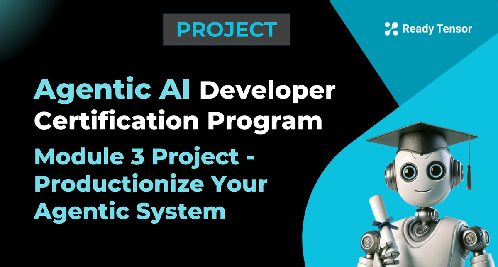

--DIVIDER--

---

[🏠 Home - All Lessons](https://app.readytensor.ai/hubs/ready_tensor_certifications)

[⬅️ Previous - Project 2 Submission Guidelines](https://app.readytensor.ai/lessons/project-2-submission-guidelines-agentic-ai-developer-certification-aaidc-week8-Vyezy1rDg6K3)

---

--DIVIDER--

# Project Context

This is the third and final core project in the Agentic AI Developer Certification Program. It builds on your earlier work developing a question-answering assistant (Module 1) and a multi-agent system (Module 2).

In this capstone project, you’ll take your multi-agent system from Module 2 and transform it into a production-grade AI application — tested, safe, user-ready, and portfolio-worthy.

---

--DIVIDER--

# Project Objectives

This capstone project is based on the multi-agent system you (or your team) built in [Module 2: Build a Multi-Agent System](https://app.readytensor.ai/lessons/gUPu2RlgjzNy). If you haven’t completed that project yet, or if you’re joining the program partway through, we recommend reviewing it before starting here.

In this final project, you’ll demonstrate your ability to prepare an agentic AI system for real-world use by enhancing it with the following capabilities:

- **Production Readiness**: Transform your prototype into a robust, deployable system
- **Quality Assurance**: Implement comprehensive testing strategies for multi-agent workflows
- **Security & Safety**: Add guardrails, input validation, and safety mechanisms
- **User Experience**: Create an intuitive, user-friendly interface
- **Operational Excellence**: Integrate monitoring, logging, and resilience features
- **Documentation**: Produce clear technical documentation for maintainability and handoff

---

--DIVIDER--

# What You'll Build 🛠️

You’ll take your Module 2 multi-agent prototype and transform it into a production-ready application that meets professional software standards.

Your final system must include:

**Required Components:**

1.  ✅ **Comprehensive Testing Suite**

    - Unit tests for individual agent functions and tools
    - Integration tests for agent-to-agent communication
    - End-to-end system tests for complete workflows
    - Test coverage of at least 70% for core functionality

2.  ✅ **Safety & Security Guardrails**

    - Input validation and sanitization
    - Output filtering and content safety measures
    - Error handling with graceful degradation
    - Logging for compliance and debugging

3.  ✅ **User Interface**

    - Interactive web application using Gradio, Streamlit, or similar framework
    - Intuitive design that abstracts away technical complexity
    - Clear error messages and user guidance

4.  ✅ **Resilience & Monitoring**

    - Retry logic with exponential backoff for failed tool or LLM calls
    - Timeout handling to prevent long-running or stalled workflows
    - Basic loop limits or iteration caps to avoid infinite cycles
    - Graceful handling of agent failures and timeouts
    - Logging of failures, retries, and fallback events for debugging and traceability

> _You don’t need to implement all of these — just choose the ones most relevant to your system’s risks. The goal is to handle failure gracefully and avoid silent breakage._

5.  ✅ **Professional Documentation**
    - High-level system overview including purpose, architecture, and key components
    - Deployment and configuration guide with setup instructions (README, .env.sample, etc.)
    - API or interface specifications and expected input/output formats (if applicable)
    - Logging, health check, and maintenance considerations for long-term use
    - Troubleshooting guide and FAQ for common issues and recovery steps

---

--DIVIDER--

# Example: Publication Assistant for AI Projects 📘

If you built a multi-agent assistant that helps users improve their AI/ML project documentation, this is your chance to take it to the next level.

Your final version could:

- Add a clean web interface where users paste their documentation or upload a document and get suggestions in real time
- Use clear visual cues for improvement areas (titles, tags, summaries, etc.)
- Add basic input validation and guardrails to avoid unsafe responses
- Handle errors gracefully for invalid or unsupported submissions
- Include a basic deployment wrapper using FastAPI, Streamlit, or Gradio

Want to go further? Add monitoring, export features, or even allow signed-in users to save their history.

> 🎯 The goal isn’t to build a new system — it’s to show that you can take your working prototype and make it safe, testable, and usable by real users.

---

--DIVIDER--

# Applying Enhancements to Your Own Project 🧱

No matter what your Module 2 system was designed to do, your job in this final project is to **make it ready for real-world use**.

Apply the enhancements listed under the **Required Components** section — including testing, guardrails, resilience, and documentation — in the context of your specific project.

> 🎯 Focus on stability, safety, and clarity — not on adding new agents or features. The goal is to make your existing system robust, trustworthy, and easy to use.

---

--DIVIDER--

:::info{title="Submission Deadlines"}

Your Module 3 project will be reviewed in the cycle for the month corresponding to your submission date.  
To be part of that month’s review, make sure to submit **on or before one of these dates**:

- ✅ August 11, 2025 — 11:59 PM UTC
- ✅ September 05, 2025 — 11:59 PM UTC
- ✅ October 03, 2025 — 11:59 PM UTC
- ✅ November 03, 2025 — 11:59 PM UTC
- ✅ December 01, 2025 — 11:59 PM UTC

Missed a date? You can still submit before the next deadline and your project will be included in that month’s review cycle.

Reviews generally take up to **2 weeks** after the submission deadline, covering both reviewer feedback and any follow-up changes you provide.

:::

---

--DIVIDER--

# Submission Checklist ✅

To complete this project, you need to submit two deliverables:

## **1. Project Publication 📝**

Create a comprehensive publication on the Ready Tensor platform that:

- Describes your production system architecture and key improvements
- Documents your testing strategy and security implementations
- Demonstrates the user interface and operational features
- Follows best practices from our Technical Evaluation Rubric for the **Tool / App / Software Development** category
- Meets at least 80% of the listed criteria (higher bar for final project)

📄 [Publication: Technical Evaluation Rubric](https://app.readytensor.ai/publications/WsaE5uxLBqnH)

The rubric is general-purpose. You still need to meet project-specific expectations (e.g. comprehensive testing, security measures, UI implementation, etc).

## **2. Project GitHub Repository 🗂️**

Submit a repo that:

- Contains production-ready code with comprehensive testing suite
- Includes detailed setup, deployment, and usage documentation
- Demonstrates security measures and monitoring capabilities
- Provides working UI application with clear user workflows
- Meets the **"Professional"** level of our repo evaluation rubric
- Satisfies at least 80% of the Professional criteria

📄 [Repository Evaluation Rubric](https://app.readytensor.ai/publications/0llldKKtn8Xb)

---

--DIVIDER--

# Final Thoughts 💡

This is the most demanding project in the Agentic AI Developer Certification Program — and for good reason.

You’ve already built something creative and functional in Module 2. Now it’s time to show that you can take that prototype and elevate it to **production-grade quality** — with testing, safety, user experience, and documentation that meets industry expectations.

> **💼 This is the kind of work companies want to see: not just ideas, but ideas made real, responsibly and reliably.**

Treat this as your opportunity to **demonstrate real-world engineering skills** — to show you're not just building toy demos, you're building agentic systems people can actually use.

You’ll separate yourself from the crowd with this project. Good luck — and build boldly.

--DIVIDER--

---

[🏠 Home - All Lessons](https://app.readytensor.ai/hubs/ready_tensor_certifications)

[⬅️ Previous - Project 2 Submission Guidelines](https://app.readytensor.ai/lessons/project-2-submission-guidelines-agentic-ai-developer-certification-aaidc-week8-Vyezy1rDg6K3)

---
