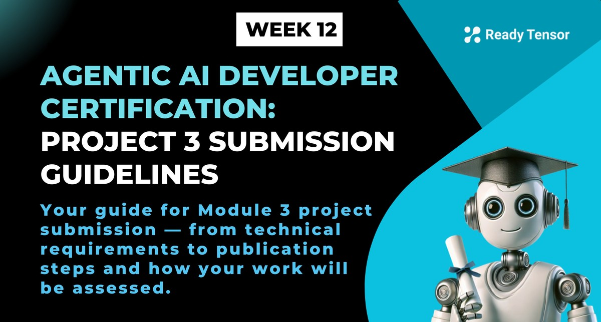

--DIVIDER--

---

[🏠 Home - All Lessons](https://app.readytensor.ai/hubs/ready_tensor_certifications)

[⬅️ Previous - Agentic System Architect's Blueprint](https://app.readytensor.ai/publications/DBt437eCRgoK)

---

--DIVIDER--

# 🎯 Time to Deliver: Submitting Your Final Project

You’ve reached the final milestone of the Agentic AI Developer Certification Program.

This capstone is your opportunity to demonstrate everything you’ve learned — not just about agents and collaboration, but about building **real-world AI systems that are safe, testable, and deployable**.

This guide walks you through the submission process.

---

--DIVIDER--

# ✅ Submission Requirements

Your final project must demonstrate a production-ready version of the multi-agent system you built in Module 2. You are expected to show improvements across the following areas:

- Testing
- Safety
- User Interface
- Operational resilience
- Documentation

 <h3>What to Submit</h3>
 
 You need to submit:
 
 ## 1. A Ready Tensor Publication
 
 Your public-facing project report, published on the Ready Tensor platform, should:
 
 - Explain how your system works and what problem it solves
 - Detail the enhancements made to achieve production-readiness
 - Document your testing strategy, safety features, and interface design
 - Include screenshots or demos of your UI
 - Clearly identify failure handling, monitoring, and deployment choices
 - Use the tag: `AAIDC-M3`
 - Optional (but highly recommended): Include a short video demo of your system in action
 
 Note you may link to your publication from Module 2 if you built upon that work. No need to duplicate the content. You may still want to summarize the project and what was done in Module 2.
 
 📄 [Publication Evaluation Rubric](https://app.readytensor.ai/publications/WsaE5uxLBqnH)
 
 ## 2. A GitHub Repository
 
 Your code repository should:
 
 - Contain well-structured, working code with instructions to set up and run the app
 - Include a testing suite (unit, integration, and system tests)
 - Show evidence of input validation, error handling, and security guardrails
 - Include a working UI layer using Streamlit, Gradio, or similar
 - Meet at least 80% of the “Professional” criteria in the Ready Tensor repo rubric
 
 📄 [Repository Evaluation Rubric](https://app.readytensor.ai/publications/0llldKKtn8Xb)
 
 ---

--DIVIDER--

:::info{title="🗓️ Submission Deadlines"}

Your project will be reviewed in the month matching your submission date.

Submit by any one of the following:

- ✅ August 11, 2025 — 11:59 PM UTC
- ✅ September 05, 2025 — 11:59 PM UTC
- ✅ October 03, 2025 — 11:59 PM UTC
- ✅ November 03, 2025 — 11:59 PM UTC
- ✅ December 01, 2025 — 11:59 PM UTC

Missed this month's deadline? Just submit before the next and you'll be reviewed in that month's review cycle.

:::

---

--DIVIDER--

# 📦 Submission Process: Step-by-Step

## Step 1: Create Your Publication

Create a new publication in the **team lead’s** personal hub. This should be a detailed write-up of your final, production-grade system.

## Step 2: Add the Required Tag

Tag the publication with `AAIDC-M3` to indicate it's a Module 3 capstone submission.

## Step 3: Add Teammates

Include all teammates as co-authors on the publication. The team lead should be listed first.

## Step 4: Link Your Code

Paste your GitHub repo URL in the “Code” section. Make sure it’s public and includes all files, tests, and documentation.

## Step 5: Include a Demo (Recommended)

Upload a video demo to YouTube and embed the link in your publication. Walk through your app, explain how it works, and show key features.

## Step 6: Final Review

Proofread everything. Test your app from scratch. Run your test suite. Then hit publish.

---

--DIVIDER--

:::tip{title="Bonus Tip: Include a Video Demo!"}

A short demo video (2–5 minutes) helps reviewers understand your project faster — and makes a great portfolio piece. Show your interface, walk through a user flow, highlight guardrails or logging, and explain your design decisions.

Upload to YouTube and link it in your Ready Tensor publication.

:::

---

--DIVIDER--

# 📋 Final Submission Checklist

 <h2> Publication </h2>
 
 - [ ] Published on Ready Tensor
 - [ ] Includes `AAIDC-M3` tag
 - [ ] Created by team lead
 - [ ] Co-authors added
 - [ ] Problem, architecture, UI, and safety enhancements documented
 - [ ] Linked GitHub repo
 - [ ] (Optional) Video demo embedded
 
 <h2> GitHub Repo </h2>
 
 - [ ] Complete, functional system code
 - [ ] Clear instructions for setup and usage
 - [ ] Testing suite (unit, integration, end-to-end)
 - [ ] Guardrails (against prompt injection, abuse, etc.)
 - [ ] UI (Streamlit, Gradio, or equivalent)
 - [ ] `.env.example` file for required environment variables
 - [ ] Logging or monitoring utilities included (if any)
 - [ ] No hardcoded secrets or sensitive keys
 
 ---

--DIVIDER--

# 🧪 Evaluation Criteria

Each submission is reviewed based on two rubrics:

- **Publication Rubric** (tool/app/software development)
- **Repository Rubric** (professional-level standards)

Expect reviewers to:

- Test your app end-to-end
- Inspect your code, test suite, and documentation
- Evaluate safety, usability, and resilience features
- Provide feedback and a certification decision

Minimum score for certification: **80% in both rubrics**

---

--DIVIDER--

# 🚀 Finish Strong: Your Final Test as an Agentic AI Engineer

This is your final test — not just of technical skill, but of **your ability to build systems that are safe, reliable, and ready for the real world**.

Your reviewers will be asking:
Can you think like a system architect?
Can you handle edge cases, catch failures, and build something others can trust and reuse?

If you can — and you meet the project requirements — you’ll earn the **Agentic AI Developer Certificate**. But more importantly, you’ll finish with a **production-grade portfolio project** you can share proudly with employers, collaborators, and future teams.

> 💼 This is what sets you apart — not just knowing how to build with AI, but how to engineer reliable, real-world systems.

You’ve come this far. Now finish strong.
Build boldly. Ship with confidence. You’ve got this.

---

--DIVIDER--

:::tip{title="Need Help?"}
Join us on [Discord](https://discord.gg/readytensor) for support, collaboration, and last-minute questions. The community — and the Ready Tensor team — is here to help.
:::

---

--DIVIDER--

# 📚 Helpful Resources

- [Project 3 Requirements](https://app.readytensor.ai/publications/DSYotKAAvcxy)
- [Publication Rubric](https://app.readytensor.ai/publications/WsaE5uxLBqnH)
- [Repository Rubric](https://app.readytensor.ai/publications/0llldKKtn8Xb)
- [Ready Tensor Publication Best Practices](https://app.readytensor.ai/publications/SBgkOyUsP8qQ)

--DIVIDER--

---

[🏠 Home - All Lessons](https://app.readytensor.ai/hubs/ready_tensor_certifications)

[⬅️ Previous - Agentic System Architect's Blueprint](https://app.readytensor.ai/publications/DBt437eCRgoK)

---
